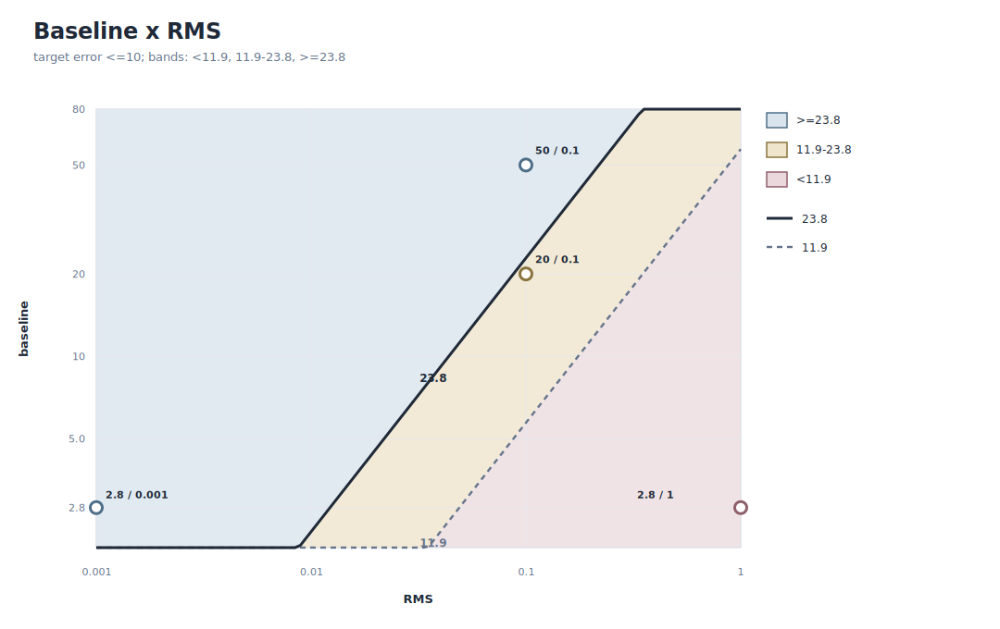
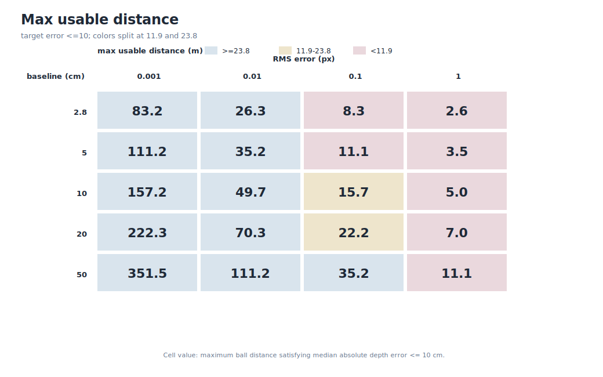
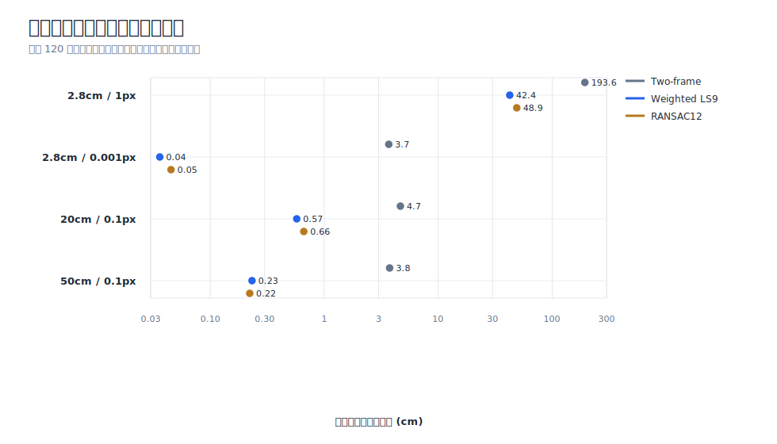
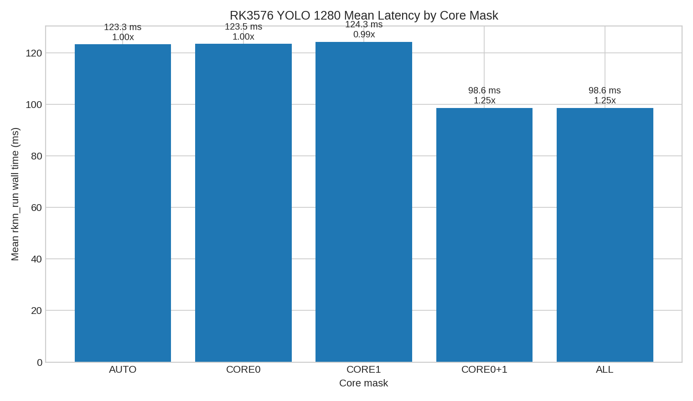
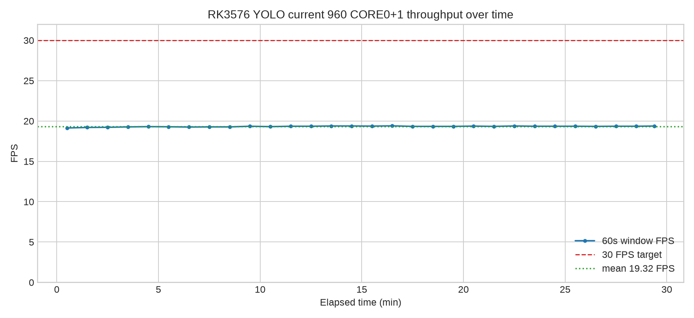
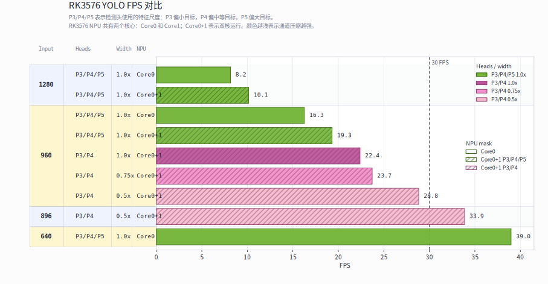

# TennisBot 双周工作报告

周期：2026-06-15 至 2026-06-28
范围：顶层集成仓库、WebSim/ROS 仿真、双目轨迹预测、YOLO/RKNN 检测、相机标定、实时双目追球 GUI、主仓架构重构。

## 1. 总体进展

本周期的工作重点从分散实验逐步转向实机追球系统的主线集成。

1. 建立 `TennisBot` 顶层集成仓库，将 `CameraCalibLab`、`TennisBallDetectorLab`、`BallTrajectoryLab`、`TennisWebSim`、`TennisBotCV` 纳入统一版本管理。
2. 完成 WebSim 侧双目几何、轨迹预测和 ROS/Gazebo 后端验证，确认控制命令链路已通，但 Gazebo 物理运动仍未生效。
3. 完成 RK3576 上 YOLO/RKNN 性能测试，明确当前模型达不到稳定 30 FPS，并给出 P3/P4、0.5x、896 输入的候选优化方向。
4. 推进 ChArUco 相机标定工具，完成自动采集 GUI、rational distortion 默认模型、cam2 标定、固定内参 stereo 标定。
5. 在 `TennisBallDetectorLab` 中实现实时双目追球 GUI，支持 YOLO/HSV 检测、双目匹配、三角化、3D 坐标和 X/Z 位置图。
6. 6 月 28 日启动架构重构，将系统目标结构收敛到 `apps/live3d`、`packages/core`、`packages/contracts`、`tools/yolo`、`tools/calibration`。

## 2. 版本与提交概况

本周期主仓共有 `99` 个 commit，其中 `92` 个非 merge commit，`7` 个 merge commit。

| 日期 | commit 数 | 主要内容 |
| --- | ---: | --- |
| 2026-06-15 | 21 | 初始化顶层仓库；WebSim 仿真、轨迹预测、ROS/Gazebo 验证 |
| 2026-06-17 | 20 | RK3576 YOLO/RKNN 性能测试；YOLO 结构裁剪实验；标定文档更新 |
| 2026-06-18 | 1 | 网球 sprite 提取 |
| 2026-06-19 | 15 | ChArUco 自动采集 GUI、rational distortion、图像质量和重采样实验 |
| 2026-06-21 | 1 | CameraCalibLab stereo GUI 子模块更新 |
| 2026-06-22 | 14 | cam2/stereo 标定、实时双目追球 GUI、HSV 检测、单相机微调数据流 |
| 2026-06-28 | 27 | 架构简化计划、多 agent 重构、`live3d`、`core`、`contracts`、artifact loader |

## 3. WebSim、双目几何与 ROS/Gazebo 验证

### 3.1 双目基线与落点误差分析

完成 baseline、检测/标定 RMS、距离和算法对落点精度影响的系统分析。结论是：远场深度误差由双目几何主导，短 baseline 会在全场距离下被 `Z^2 / B` 放大，算法只能降低多帧噪声，不能弥补硬件几何不足。

关键数值：

| 场景 | 保持 <=10cm 深度误差的最大距离 |
| --- | ---: |
| 2.8cm baseline + 0.1px RMS | 8.3m |
| 20cm baseline + 0.1px RMS | 22.2m |
| 50cm baseline + 0.1px RMS | 35.2m |

标准网球场全长为 `23.77m`。因此，2.8cm baseline 只适合理想仿真或近距离验证；真实接球更推荐 `20cm` 以上 baseline，稳定方案倾向 `50cm baseline + <=0.1px RMS`。





### 3.2 轨迹预测算法对比

在 30 FPS 条件下，对 two-frame、Weighted LS9、RANSAC12 进行仿真比较。Weighted LS9 在低噪声场景中输出速度快、误差低；RANSAC12 更适合处理 YOLO 或三角化偶发跳点。

关键结果：

| 场景 | Two-frame 中位落点误差 | Weighted LS9 中位落点误差 | RANSAC12 中位落点误差 |
| --- | ---: | ---: | ---: |
| 2.8cm / 1px | 193.6cm | 42.4cm | 48.9cm |
| 2.8cm / 0.001px | 3.7cm | 0.04cm | 0.05cm |
| 20cm / 0.1px | 4.7cm | 0.57cm | 0.66cm |
| 50cm / 0.1px | 3.8cm | 0.23cm | 0.22cm |

预测延迟：

| 算法 | 首次弱置信预测 | 满窗口预测 |
| --- | ---: | ---: |
| Weighted LS9 | 约 0.13s | 约 0.27s |
| RANSAC12 | 约 0.17s | 约 0.37s |



### 3.3 ROS/Gazebo 后端验证

完成 WebSim + ROS/Gazebo headless 后端测试。验证结果显示：

- Gazebo、ROS control、`omni3_hub`、point controller 能启动。
- `/omni3_api/target` 能转发到 `/target_pose`。
- `/cmd_vel` 和三个 rim velocity controller 命令话题均有非零输出。
- 但 `/omni3_pose` 基本停在原点，机器人在 Gazebo 中没有真实位移。

关键测试结果：

| 测试 | 目标 | 指令峰值 | 位姿变化 | 结论 |
| --- | --- | --- | ---: | --- |
| 近目标 | `(1.0, 0.5), T=3s` | `/cmd_vel.x=0.667m/s`, `/cmd_vel.y=0.333m/s` | 约 `3.4e-7m` | 控制命令有输出，Gazebo 车体未移动 |
| 远目标 | `(3.0, 2.0), T=6s` | `/cmd_vel.x=1.000m/s`, `/cmd_vel.y=0.667m/s` | 约 `2.4e-8m` | 更大目标仍未产生物理位移 |

判断：问题位于 Gazebo/URDF/轮组物理响应路径，而不是 WebSim、ROSBridge、目标转发或高层控制器。

## 4. YOLO/RKNN 检测与性能实验

### 4.1 RK3576 core mask 测试

验证 RK3576 的 RKNN 模型可以显式使用双 NPU core。`AUTO` 模式近似只使用 Core0；显式 `CORE0+1` 可以降低模型执行延迟，但无法单独满足高帧率闭环需求。

| 模式 | 平均延迟 | p95 延迟 | Wall FPS | 相对 AUTO 加速 |
| --- | ---: | ---: | ---: | ---: |
| AUTO | 123.26ms | 125.81ms | 7.95 | 1.00x |
| CORE0 | 123.45ms | 125.98ms | 7.95 | 1.00x |
| CORE1 | 124.26ms | 127.14ms | 8.08 | 0.99x |
| CORE0+1 | 98.56ms | 101.32ms | 10.17 | 1.25x |
| ALL | 98.61ms | 101.07ms | 10.00 | 1.25x |



### 4.2 当前 960 模型 30 分钟稳定性测试

对当前训练好的 `960x960` YOLO/RKNN 模型进行了约 30 分钟压力测试。

| 指标 | 数值 |
| --- | ---: |
| 循环次数 | 34,500 |
| 失败次数 | 0 |
| 平均 FPS | 19.32 |
| 平均延迟 | 51.76ms |
| p95 延迟 | 54.82ms |
| p99 延迟 | 56.19ms |
| 60s 窗口 FPS 最小值 | 19.13 |
| 60s 窗口 FPS 最大值 | 19.40 |
| NPU 频率 | 950MHz |
| NPU 温度范围 | 约 50.85C 至 53.62C |

结论：当前模型稳定，没有明显热降频，但 `19.3 FPS` 低于 `30 FPS` 目标。瓶颈主要是 RKNN graph 执行。



### 4.3 模型输入尺寸与结构裁剪

完成当前模型输入尺寸 sweep 和 P3/P4 结构裁剪测试。

| 模型 | 输入 | FPS | p95 延迟 | 说明 |
| --- | ---: | ---: | ---: | --- |
| Current P3/P4/P5 | 1280 | 8.15 | 125.16ms | 当前模型，大输入，速度不足 |
| Current P3/P4/P5 | 960 | 16.27 | 64.07ms | 输入尺寸降低，仍不足 30 FPS |
| Current P3/P4/P5 | 640 | 38.98 | 27.77ms | 达到速度目标，但可能损失小球召回 |
| Current P3/P4/P5, CORE0+1 | 960 | 19.32 | 54.82ms | 30 分钟稳定测试 |
| P3/P4 c100, CORE0+1 | 960 | 22.39 | 46.93ms | 去掉 P5 有收益，不足 30 FPS |
| P3/P4 c075, CORE0+1 | 960 | 23.72 | 44.51ms | 轻度通道裁剪收益有限 |
| P3/P4 c050, CORE0+1 | 960 | 28.83 | 36.83ms | 接近 30 FPS，p95 仍超预算 |
| P3/P4 c050, CORE0+1 | 896 | 33.86 | 31.68ms | RKNN-only 测试达到 30 FPS 目标 |

候选方向：

```text
YOLO26 P3/P4 only
0.5x effective channel width
896x896 input
CORE0+1 NPU mask
```

该候选仍需真实训练、召回率验证和完整视频链路测试。



## 5. 相机标定与实时双目追球

### 5.1 ChArUco 自动采集与图像质量控制

`CameraCalibLab` 增强了 OpenCV ChArUco 自动采集 GUI：

- 实时检测并绘制 ChArUco corners。
- 仅在全角点、稳定、清晰度达标后自动保存。
- 支持屏幕位置 bucket 覆盖提示，减少重复中心图。
- 支持 dwell capture，同一位置稳定停留后自动保存。
- 使用 fresh output directory，避免覆盖已有采集/标定结果。
- 修复 DFOPTIX profile 字典，从 `DICT_4X4_100` 改为 `DICT_5X5_100`。

当前 cam1 combined rational 标定结果：

| 指标 | 数值 |
| --- | ---: |
| 输入图像 | 75 张 |
| ChArUco corners | 每张 `104/104` |
| 标定 RMS | 0.2125286741 px |
| 最大单图 RMS | 0.6016526222 px |
| distortion model | `opencv_rational` |
| distortion coefficient count | 14 |
| position buckets covered | 29 |

图像质量复核结论：当前图像不是坏图，主要问题是 top/right 覆盖不足；应补拍边缘和上方视角，而不是随机删除高 residual 图。

### 5.2 cam2 与固定内参 stereo 标定

cam2 当前 rational 标定：

| 指标 | 数值 |
| --- | ---: |
| accepted views | 35 / 35 |
| calibration RMS | 0.3181200446 px |
| max per-view RMS | 0.9484907389 px |
| point count | 3,640 |
| distortion coefficient count | 14 |

stereo fixed-intrinsics rational 标定：

| 指标 | 数值 |
| --- | ---: |
| accepted pairs | 33 |
| stereo RMS | 0.4236521002 px |
| epipolar RMS | 4.3304497344 px |
| rectification y p95 | 0.8301635742 px |
| baseline | 0.0524861644 m |
| calibration flags | `CALIB_FIX_INTRINSIC | CALIB_RATIONAL_MODEL` |

关键修正：固定内参 stereo 标定必须保留 rational distortion 的 14 系数模型。只使用 `CALIB_FIX_INTRINSIC` 会退化成 5 系数，导致 stereo RMS 异常升高到 `23.49px`。

### 5.3 实时双目追球 GUI

`TennisBallDetectorLab` 新增 `tbl stereo-gui`：

- 支持左/右相机实时画面。
- 支持 YOLO 检测框。
- 支持 HSV 快速调试检测头。
- 支持 tiled YOLO，用于 4K 小球检测。
- 加载 mono/stereo calibration，输出左相机坐标系下的 `x/y/z`。
- 显示 disparity、epipolar error、reprojection error、confidence、FPS、X/Z 位置图。

默认实机输入：

```bash
YOLO_CONFIG_DIR=/tmp/Ultralytics uv run tbl stereo-gui \
  --left-device /dev/video0 \
  --right-device /dev/video1
```

4K 小球检测：

```bash
YOLO_CONFIG_DIR=/tmp/Ultralytics uv run tbl stereo-gui --tile
```

验证结果：

| 功能 | 结果 |
| --- | --- |
| `compileall` | passed |
| pytest | `16 passed`，后续 HSV/collect-camera 后达到 `21 passed`、`29 passed` |
| `tbl stereo-gui --help` | passed |
| YOLO model load | passed |
| HSV sample tuned detection | center `(259.4, 244.2)`, box `96.0 x 96.0`, confidence `1.000` |

## 6. 6 月 28 日架构重构

6 月 28 日开始从“多个实验子仓库”转向主仓内清晰分层架构。

目标结构：

```text
TennisBot/
  apps/
    live3d/
    sim/

  packages/
    core/
    camera/
    contracts/

  tools/
    yolo/
    calibration/

  artifacts/
    calibration/
    models/
    sessions/

  docs/
```

### 6.1 `packages/contracts`

新增 TypeScript/Bun 数据契约：

- camera intrinsics；
- stereo extrinsics；
- YOLO 2D detection；
- timestamped stereo detection pair；
- triangulated 3D ball point；
- prediction curve 和 landing point；
- YOLO/calibration artifact metadata。

### 6.2 `packages/core`

迁移和实现纯算法能力：

- rectified epipolar error；
- disparity；
- 3x4 projection reprojection；
- stereo reprojection diagnostics；
- rectified stereo triangulation；
- stereo detection pairing；
- timestamp-delta filtering；
- projectile prediction 和 landing point。

测试覆盖：

- projection；
- triangulation；
- stereo pairing；
- timestamp rejection；
- trajectory prediction；
- invalid-input/no-landing 行为。

### 6.3 `apps/live3d`

新增真实机器入口的前端壳：

- 左右 USB camera panel；
- 2D YOLO-style overlay；
- 3D ball point、trail、prediction curve、landing marker；
- camera/model/calibration/tracking/prediction status；
- fixture mode 警告。

6 月 28 日状态：`live3d` 仍为 fixture/core 接线，不代表真实 USB 相机、YOLO、标定 artifact、双目追踪已经完成实机验证。

### 6.4 `tools/yolo` 与 `tools/calibration`

新增工具边界文档，明确：

- `tools/yolo` 负责数据集、标注、训练、评估、模型导出、model package。
- `tools/calibration` 负责 mono/stereo 标定、采集/review、calibration package。
- `apps/live3d` 只消费 artifact，不直接耦合训练代码或标定 GUI。

### 6.5 artifact loader

新增纯 parsed-object validation 和 conversion：

- YOLO package metadata validation；
- stereo calibration package metadata validation；
- snake_case calibration JSON 到 runtime contracts 的转换；
- checksum/bytes/file existence 作为后续 IO adapter 检查项保留。

6 月 28 日主仓结构变更规模：

| 指标 | 数值 |
| --- | ---: |
| 变更文件数 | 70 |
| 新增行数 | 约 7,198 |
| 主要新增路径 | `apps/live3d`, `packages/core`, `packages/contracts`, `tools/yolo`, `tools/calibration` |

## 7. 当前问题与风险

1. **ROS/Gazebo 实体不动**
   控制命令和轮速命令均有输出，但 Gazebo 中机器人没有位移。下一步应检查 URDF/Gazebo 物理、wheel joint command interface、collision/contact、friction 和模型约束。

2. **当前 YOLO/RKNN 模型速度不足**
   当前 960 模型稳定约 `19.3 FPS`，不满足 30 FPS 闭环目标。896/P3/P4/c050 候选只有 RKNN-only 速度验证，还没有真实训练和召回评估。

3. **远距离小球检测受分辨率/FOV/曝光限制**
   4K 30FPS 可保留远距离空间分辨率，但帧间跳动和运动模糊仍明显。1080p 全画幅会让远端球像素过少。后续需要结合短曝光、ROI/tile、长焦/多相机方案评估。

4. **双目标定仍需实机闭环验收**
   当前 fixed-intrinsics rational stereo 结果可用，但真实追球链路还需要加载同一套 artifact，在 USB 相机实时流中验证三角化稳定性。

5. **`live3d` 目前不是实机完成态**
   6 月 28 日的 `live3d` 是 fixture + core 的 UI/架构铺底；真实 USB camera、YOLO inference、artifact loading、3D runtime 主要在后续继续推进。

## 8. 下周期计划

1. 修复或绕过 Gazebo 物理运动问题，完成 ROS/Gazebo 后端真实移动验证。
2. 将 accepted calibration package 和 YOLO model package 接入 `apps/live3d`。
3. 打通双 USB 相机实时输入、YOLO 检测、stereo pairing、triangulation、3D 轨迹显示。
4. 训练并验证 P3/P4 c050 896 候选模型，比较速度、召回率和远距离小球表现。
5. 对 4K 30FPS 小球检测进行曝光、ROI/tile、镜头 FOV 和帧率组合实验。
6. 明确相机硬件方案：广角负责发现/环境，中长焦或 ROI 负责远距离精确追球。

## 9. 参考文档

- [Git management plan](git_management_plan_20260615.md)
- [Realtime stereo ball GUI result](realtime_stereo_ball_gui_result_20260622.md)
- [Realtime stereo HSV detector](realtime_stereo_hsv_detector_20260622.md)
- [Architecture simplification plan](architecture_simplification_plan_20260628.md)
- [Core migration Wave 2 result](core_migration_wave2_result_20260628.md)
- [Wave 4 artifact loaders result](multi_agent_refactor_wave4_artifact_loaders_result_20260628.md)

本报告还引用了本地归档子项目中的实验文档和图表。为保证报告可读，关键图表已复制到
`docs/assets/biweekly_report_20260615_20260628/`。原始本地来源路径包括：

- `desperate/TennisWebSim/docs/trajectory_selection_report_20260615.md`
- `desperate/TennisBallDetectorLab/docs/rk3576_yolo_size_architecture_comparison_20260617.md`
- `desperate/TennisBallDetectorLab/docs/rk3576_yolo_960_30min_stress_20260617.md`
