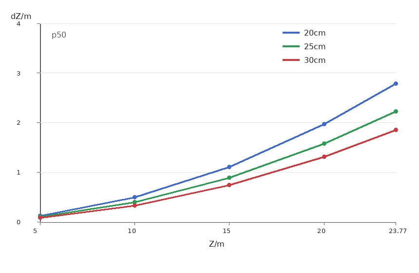
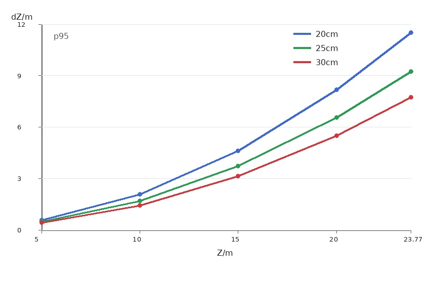
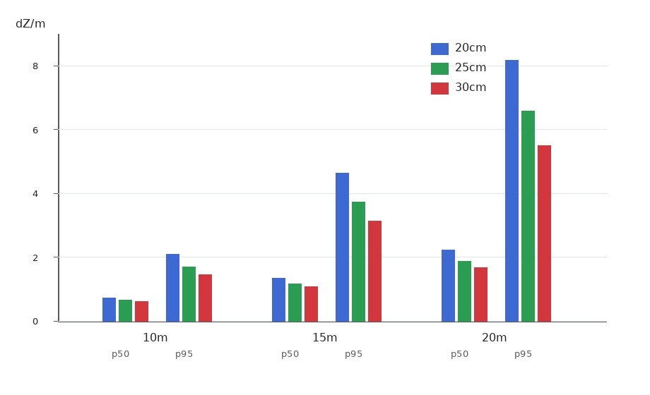

# 20cm / 25cm / 30cm baseline 深度误差分析 - 2026-07-13

## 1. 分析目标

本文只分析双目三角化的深度误差，不分析完整落点预测、不分析底盘接球闭环。

要比较的是三个 baseline：

| 方案 | baseline |
|---|---:|
| B20 | 0.20 m |
| B25 | 0.25 m |
| B30 | 0.30 m |

在本文中，相机焦距、YOLO 中心偏移、标定残差都固定为当前实测值。焦距不确定性用 bootstrap 得到，baseline 安装误差按 `1%` 假设。最终只改变两个外部变量：

- 目标距离 `Z`
- baseline `B`

## 2. 误差来源

双目深度由视差决定：

$$
Z = \frac{fB}{d}
$$

深度误差近似为：

$$
dZ = \frac{Z^2}{fB} \cdot dd
$$

其中：

- `dZ` 是深度误差；
- `Z` 是目标距离；
- `f` 是像素焦距；
- `B` 是 baseline；
- `dd` 是视差误差。

这个式子说明两个关系：

1. 距离越远，深度误差按 `Z^2` 放大；
2. baseline 越大，深度误差按 `1 / B` 下降。

因此，在其他条件固定时，baseline 从 `20cm` 增加到 `25cm` 或 `30cm`，只能按比例降低深度误差，不能改变远距离误差按平方增长的趋势。

## 3. 用于计算的固定输入和计算过程

本文只保留影响深度误差计算的数值。标定图数量、YOLO 验证图数量、GT 框数量等不参与公式计算，因此不放在正文里。

### 3.1 焦距

当前可用标定是 `1280x720`，YOLO 评测图像是 `3840x2160`。如果视场和裁切方式一致，像素焦距按分辨率比例放大 `3` 倍。

$$
\begin{aligned}
f_{720}
&= \frac{fx_{cam1} + fx_{cam2}}{2} \\
&= \frac{436.299 + 408.324}{2} \\
&= 422.311 \text{ px}
\end{aligned}
$$

$$
\begin{aligned}
f_{4k}
&= f_{720} \cdot 3 \\
&= 422.311 \cdot 3 \\
&= 1266.934 \text{ px}
\end{aligned}
$$

后续深度误差计算使用：

$$
f = 1266.934 \text{ px}
$$

焦距不确定性不能直接用标定 RMS 代替。这里使用 bootstrap 结果：

$$
\begin{aligned}
\sigma f_{720}
&= \frac{\sqrt{6.550^2 + 41.612^2}}{2} \\
&= 21.062 \text{ px}
\end{aligned}
$$

$$
\begin{aligned}
\sigma f_{4k}
&= 21.062 \cdot 3 \\
&= 63.187 \text{ px}
\end{aligned}
$$

$$
\begin{aligned}
\frac{\sigma f}{f}
&= \frac{63.187}{1266.934} \\
&= 0.0499 \\
&= 4.99\%
\end{aligned}
$$

### 3.2 标定残差

当前 stereo RMS 原始值是 `0.2121 px`，同样缩放到 4K 坐标：

$$
\begin{aligned}
stereo\_rms_{4k}
&= stereo\_rms_{720} \cdot 3 \\
&= 0.2121 \cdot 3 \\
&= 0.636 \text{ px}
\end{aligned}
$$

当前 epipolar RMS 原始值是 `0.2568 px`，用于说明双目几何质量处于像素级范围。公式里实际使用的是 stereo RMS：

$$
stereo\_rms = 0.636 \text{ px}
$$

baseline 安装误差按 `1%` 计算：

$$
\frac{\sigma B}{B} = 1\% = 0.01
$$

### 3.3 YOLO x 方向中心偏移

深度误差主要由视差误差决定，因此只使用 YOLO 的 x 方向中心偏移 `abs dx`。该偏移只统计 `IoU >= 0.5` 的正确匹配框，不包含漏检、错检和明显偏移框。

本文使用两个分位数：

| 指标 | p50 | p95 |
|---|---:|---:|
| abs dx | 0.759 px | 3.606 px |

这里的含义是：

- p50：正确检测框里的典型中心偏移；
- p95：正确检测框里偏移较大的尾部情况。

## 4. 从 YOLO 偏移得到视差误差

左右相机的 x 方向中心误差合成为视差误差：

$$
dd_{yolo} = \sqrt{2} \cdot abs(dx)
$$

### 4.1 p50 视差误差

$$
\begin{aligned}
dd_{yolo,p50}
&= \sqrt{2} \cdot 0.759 \\
&= 1.073 \text{ px}
\end{aligned}
$$

叠加标定残差：

$$
\begin{aligned}
dd_{p50}
&= \sqrt{dd_{yolo,p50}^2 + stereo\_rms^2} \\
&= \sqrt{1.073^2 + 0.636^2} \\
&= 1.247 \text{ px}
\end{aligned}
$$

### 4.2 p95 视差误差

$$
\begin{aligned}
dd_{yolo,p95}
&= \sqrt{2} \cdot 3.606 \\
&= 5.100 \text{ px}
\end{aligned}
$$

叠加标定残差：

$$
\begin{aligned}
dd_{p95}
&= \sqrt{dd_{yolo,p95}^2 + stereo\_rms^2} \\
&= \sqrt{5.100^2 + 0.636^2} \\
&= 5.139 \text{ px}
\end{aligned}
$$

汇总如下：

| 场景 | abs dx | YOLO 视差误差 | 合成视差误差 `dd` |
|---|---:|---:|---:|
| p50 | 0.759 px | 1.073 px | 1.247 px |
| p95 | 3.606 px | 5.100 px | 5.139 px |

后续分别计算 p50 和 p95 两种情况。

## 5. 固定输入后的深度误差公式

只传播视差误差时：

$$
dZ = \frac{Z^2}{fB} \cdot dd
$$

加入焦距不确定性和 baseline 1% 后，用平方和合成：

$$
\sigma Z =
\sqrt{
\left(\frac{Z^2}{fB} \cdot \sigma d\right)^2
+ \left(Z \cdot \frac{\sigma f}{f}\right)^2
+ \left(Z \cdot \frac{\sigma B}{B}\right)^2
}
$$

### 5.1 p50 深度误差公式

代入 `f = 1266.934 px`、`σd_p50 = 1.247 px`、`σf/f = 0.0499`、`σB/B = 0.01`：

$$
\sigma Z_{p50} =
\sqrt{
\left(\frac{Z^2}{1266.934B} \cdot 1.247\right)^2
+ (0.0499Z)^2
+ (0.01Z)^2
}
$$

其中视差项可以整理为：

$$
\frac{Z^2}{1266.934B} \cdot 1.247
= 0.0009846 \cdot \frac{Z^2}{B}
$$

### 5.2 p95 深度误差公式

代入 `f = 1266.934 px`、`σd_p95 = 5.139 px`、`σf/f = 0.0499`、`σB/B = 0.01`：

$$
\sigma Z_{p95} =
\sqrt{
\left(\frac{Z^2}{1266.934B} \cdot 5.139\right)^2
+ (0.0499Z)^2
+ (0.01Z)^2
}
$$

其中视差项可以整理为：

$$
\frac{Z^2}{1266.934B} \cdot 5.139
= 0.0040565 \cdot \frac{Z^2}{B}
$$

单位：

- `Z`: m
- `B`: m
- `σZ`: m

到这里，除了目标距离 `Z` 和 baseline `B`，其他变量都已经固定。

## 6. p50 深度误差

p50 表示在已经正确检测到目标时，YOLO 中心偏移的中位数情况。

| baseline | 5m | 10m | 15m | 20m | 23.77m |
|---|---:|---:|---:|---:|---:|
| 20cm | 0.283 | 0.708 | 1.345 | 2.217 | 3.033 |
| 25cm | 0.273 | 0.643 | 1.169 | 1.875 | 2.533 |
| 30cm | 0.267 | 0.605 | 1.062 | 1.661 | 2.214 |

下图对应 p50 情况。加入 `σf` 和 baseline 1% 后，baseline 仍然能降低深度误差，但下降幅度小于只看视差项时的 `1/B` 比例。

## 7. p95 深度误差

p95 表示在已经正确检测到目标时，YOLO 中心偏移较大的尾部情况。它不是系统最坏情况，因为漏检和错检没有纳入这里。

| baseline | 5m | 10m | 15m | 20m | 23.77m |
|---|---:|---:|---:|---:|---:|
| 20cm | 0.567 | 2.091 | 4.627 | 8.177 | 11.524 |
| 25cm | 0.479 | 1.700 | 3.730 | 6.570 | 9.247 |
| 30cm | 0.423 | 1.445 | 3.137 | 5.504 | 7.735 |

下图对应 p95 情况。由于视差误差从 `1.247px` 增加到 `5.139px`，所有 baseline 的深度误差都会明显放大。

## 8. 10m / 15m / 20m 对比

这张图把 `10m`、`15m`、`20m` 三个距离的 p50 和 p95 结果放在一起，方便直接比较 baseline 对深度误差的影响。

## 9. baseline 比例关系

如果只看视差项，baseline 比例可以直接按 `1 / B` 计算：

| baseline 变化 | 深度误差比例 | 深度误差下降 |
|---|---:|---:|
| 20cm -> 25cm | 0.800x | 20.0% |
| 20cm -> 30cm | 0.667x | 33.3% |
| 25cm -> 30cm | 0.833x | 16.7% |

加入 `σf` 和 baseline 1% 后，焦距项和 baseline 安装项不随 `B` 下降，因此总误差下降会小一些。以 20m 为例：

| 场景 | 25cm / 20cm | 30cm / 20cm | 30cm / 25cm |
|---|---:|---:|---:|
| p50 | 0.846x | 0.749x | 0.886x |
| p95 | 0.803x | 0.673x | 0.838x |
