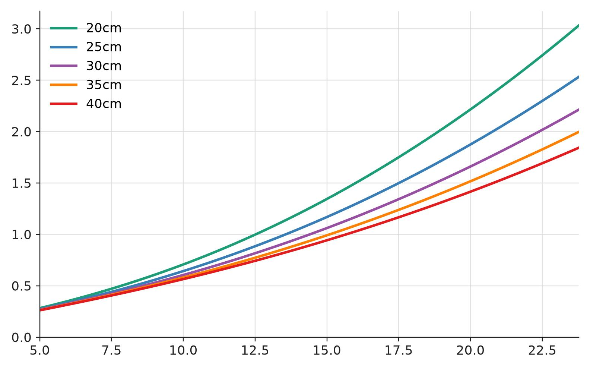
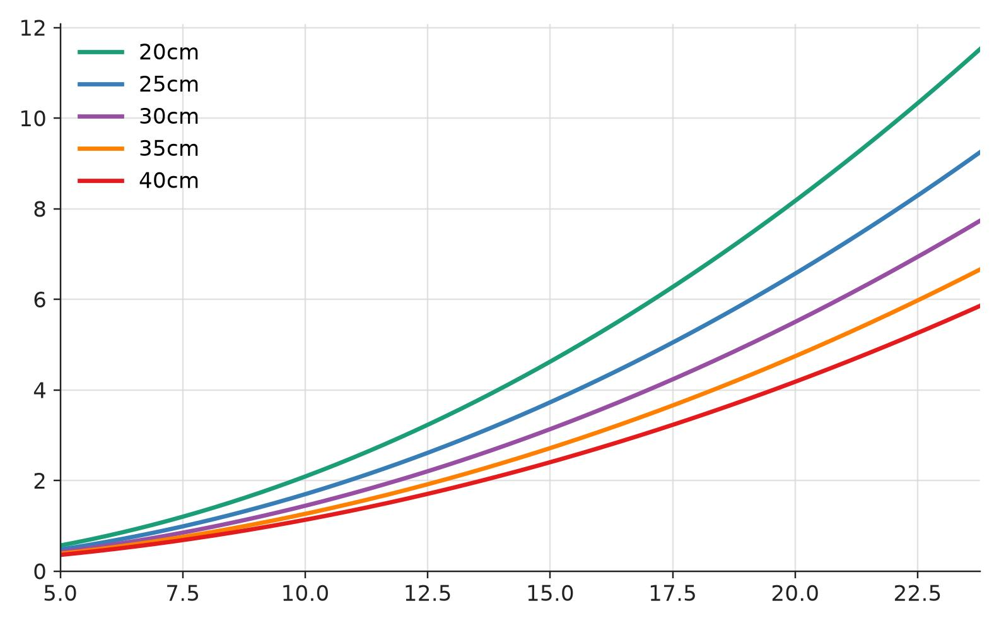
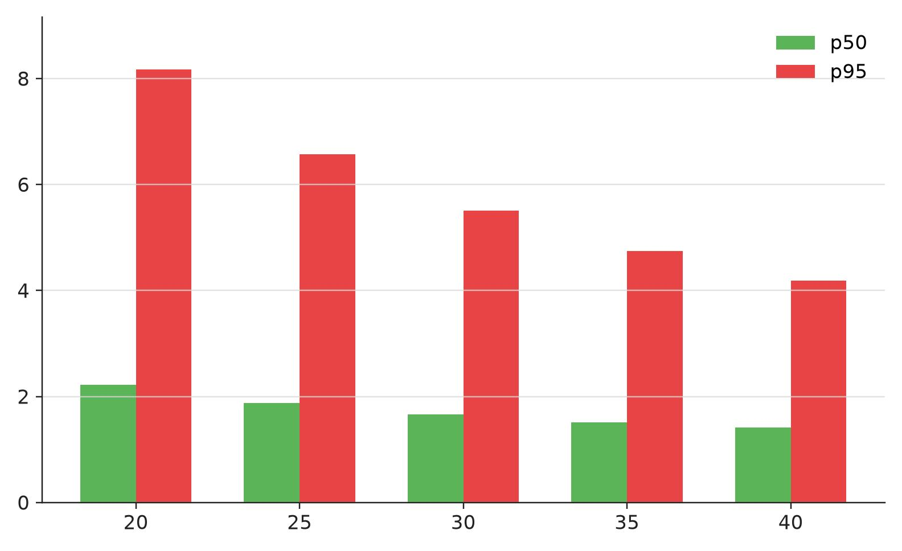

# 20cm / 25cm / 30cm / 35cm / 40cm baseline 深度误差分析 - 2026-07-13

## 1. 分析目标

这份分析把当前实测的相机焦距、YOLO 中心偏移和双目标定残差固定下来，用同一套三角化模型比较 `20cm`、`25cm`、`30cm`、`35cm`、`40cm` 五种 baseline 对深度误差的影响。35cm 和 40cm 按同等标定质量、同等检测误差、同等相对安装误差进行模型外推。

| 方案 | baseline |
|---|---:|
| B20 | 0.20 m |
| B25 | 0.25 m |
| B30 | 0.30 m |
| B35 | 0.35 m |
| B40 | 0.40 m |

计算变量保留为目标距离 `Z` 和 baseline `B`，其他输入使用当前实测数据或明确假设。

## 2. 误差来源

双目深度由焦距、baseline 和视差共同决定，计算关系如下。

$$
Z = \frac{fB}{d}
$$

对视差做一阶误差传播后，深度误差可以近似写成下面的形式。

$$
dZ = \frac{Z^2}{fB} \cdot dd
$$

这里 `Z` 是目标距离，`f` 是像素焦距，`B` 是 baseline，`dd` 是视差误差。距离 `Z` 以平方进入误差项，所以远距离深度误差增长很快；baseline `B` 在分母中，所以增大 baseline 可以压低由视差引起的深度误差。在其他输入固定时，baseline 越大，三角化深度误差越小，但远距离误差的平方增长趋势保持不变。

## 3. 固定输入和计算过程

计算输入保留直接进入深度误差公式的数值，包括 4K 等效像素焦距、焦距不确定性、stereo RMS、baseline 安装误差和 YOLO x 方向中心偏移。

### 3.1 焦距

当前可用标定分辨率为 `1280x720`，YOLO 评测图像分辨率为 `3840x2160`。在视场和裁切方式一致的条件下，像素焦距按分辨率比例放大 `3` 倍。

$$
\begin{aligned}
f_{720}
&= \frac{fx_{cam1} + fx_{cam2}}{2} \\
&= \frac{436.299 + 408.324}{2} \\
&= 422.311 \text{ px}
\end{aligned}
$$

$$
\begin{aligned}
f_{4k}
&= f_{720} \cdot 3 \\
&= 422.311 \cdot 3 \\
&= 1266.934 \text{ px}
\end{aligned}
$$

深度误差计算使用 4K 等效像素焦距。

$$
f = 1266.934 \text{ px}
$$

焦距不确定性使用 bootstrap 结果。

$$
\begin{aligned}
\sigma f_{720}
&= \frac{\sqrt{6.550^2 + 41.612^2}}{2} \\
&= 21.062 \text{ px}
\end{aligned}
$$

$$
\begin{aligned}
\sigma f_{4k}
&= 21.062 \cdot 3 \\
&= 63.187 \text{ px}
\end{aligned}
$$

$$
\begin{aligned}
\frac{\sigma f}{f}
&= \frac{63.187}{1266.934} \\
&= 0.0499 \\
&= 4.99\%
\end{aligned}
$$

### 3.2 标定残差和 baseline 安装误差

当前 stereo RMS 原始值为 `0.2121 px`，缩放到 4K 坐标后得到 4K 等效残差。

$$
\begin{aligned}
stereo\_rms_{4k}
&= stereo\_rms_{720} \cdot 3 \\
&= 0.2121 \cdot 3 \\
&= 0.636 \text{ px}
\end{aligned}
$$

当前 epipolar RMS 原始值为 `0.2568 px`，用于说明双目几何质量处于像素级范围。公式里使用 stereo RMS。

$$
stereo\_rms = 0.636 \text{ px}
$$

baseline 安装误差按 `1%` 计算。

$$
\frac{\sigma B}{B} = 1\% = 0.01
$$

### 3.3 YOLO x 方向中心偏移

深度误差主要受视差误差影响，因此检测误差取 YOLO 的 x 方向中心偏移 `abs dx`。统计口径采用 `IoU >= 0.5` 的正确匹配框，得到有效检测后的定位偏移。

| 指标 | p50 | p95 |
|---|---:|---:|
| abs dx | 0.759 px | 3.606 px |

p50 表示有效检测框里的典型中心偏移，p95 表示有效检测框里的尾部偏移。

## 4. 从 YOLO 偏移得到视差误差

左右相机的 x 方向中心误差合成为视差误差。

$$
dd_{yolo} = \sqrt{2} \cdot abs(dx)
$$

p50 情况下，YOLO 导致的视差误差为：

$$
\begin{aligned}
dd_{yolo,p50}
&= \sqrt{2} \cdot 0.759 \\
&= 1.073 \text{ px}
\end{aligned}
$$

叠加标定残差后，p50 合成视差误差为：

$$
\begin{aligned}
dd_{p50}
&= \sqrt{dd_{yolo,p50}^2 + stereo\_rms^2} \\
&= \sqrt{1.073^2 + 0.636^2} \\
&= 1.247 \text{ px}
\end{aligned}
$$

p95 情况下，YOLO 导致的视差误差为：

$$
\begin{aligned}
dd_{yolo,p95}
&= \sqrt{2} \cdot 3.606 \\
&= 5.100 \text{ px}
\end{aligned}
$$

叠加标定残差后，p95 合成视差误差为：

$$
\begin{aligned}
dd_{p95}
&= \sqrt{dd_{yolo,p95}^2 + stereo\_rms^2} \\
&= \sqrt{5.100^2 + 0.636^2} \\
&= 5.139 \text{ px}
\end{aligned}
$$

| 场景 | abs dx | YOLO 视差误差 | 合成视差误差 `dd` |
|---|---:|---:|---:|
| p50 | 0.759 px | 1.073 px | 1.247 px |
| p95 | 3.606 px | 5.100 px | 5.139 px |

p50 和 p95 分别代表有效检测后的典型情况和尾部情况。

## 5. 深度误差公式

只传播视差误差时，深度误差写成下面的形式。

$$
dZ = \frac{Z^2}{fB} \cdot dd
$$

加入焦距不确定性和 baseline 1% 后，误差按平方和合成。

$$
\sigma Z =
\sqrt{
\left(\frac{Z^2}{fB} \cdot \sigma d\right)^2
+ \left(Z \cdot \frac{\sigma f}{f}\right)^2
+ \left(Z \cdot \frac{\sigma B}{B}\right)^2
}
$$

p50 代入 `f = 1266.934 px`、`σd_p50 = 1.247 px`、`σf/f = 0.0499`、`σB/B = 0.01`。

$$
\sigma Z_{p50} =
\sqrt{
\left(\frac{Z^2}{1266.934B} \cdot 1.247\right)^2
+ (0.0499Z)^2
+ (0.01Z)^2
}
$$

其中视差项可以整理为：

$$
\frac{Z^2}{1266.934B} \cdot 1.247
= 0.0009843 \cdot \frac{Z^2}{B}
$$

p95 代入 `f = 1266.934 px`、`σd_p95 = 5.139 px`、`σf/f = 0.0499`、`σB/B = 0.01`。

$$
\sigma Z_{p95} =
\sqrt{
\left(\frac{Z^2}{1266.934B} \cdot 5.139\right)^2
+ (0.0499Z)^2
+ (0.01Z)^2
}
$$

其中视差项可以整理为：

$$
\frac{Z^2}{1266.934B} \cdot 5.139
= 0.004056 \cdot \frac{Z^2}{B}
$$

单位统一为 `Z: m`、`B: m`、`σZ: m`。

## 6. p50 深度误差

p50 表示有效检测后的典型中心偏移情况。

| baseline | 5m | 10m | 15m | 20m | 23.77m |
|---|---:|---:|---:|---:|---:|
| 20cm | 0.283 | 0.708 | 1.345 | 2.216 | 3.032 |
| 25cm | 0.273 | 0.643 | 1.169 | 1.875 | 2.532 |
| 30cm | 0.267 | 0.606 | 1.062 | 1.661 | 2.214 |
| 35cm | 0.264 | 0.581 | 0.992 | 1.517 | 1.997 |
| 40cm | 0.262 | 0.565 | 0.943 | 1.416 | 1.843 |

加入 `σf` 和 baseline 1% 后，baseline 仍然能降低深度误差，但下降幅度小于单独视差项的 `1/B` 比例。

## 7. p95 深度误差

p95 表示有效检测后的尾部中心偏移情况。

| baseline | 5m | 10m | 15m | 20m | 23.77m |
|---|---:|---:|---:|---:|---:|
| 20cm | 0.567 | 2.091 | 4.627 | 8.176 | 11.523 |
| 25cm | 0.479 | 1.700 | 3.730 | 6.569 | 9.247 |
| 30cm | 0.423 | 1.445 | 3.137 | 5.503 | 7.735 |
| 35cm | 0.386 | 1.266 | 2.717 | 4.746 | 6.659 |
| 40cm | 0.359 | 1.135 | 2.406 | 4.182 | 5.856 |

p95 的视差误差从 `1.247px` 增加到 `5.139px`，各 baseline 的深度误差都会明显放大。

## 8. 20m 对比

`20m` 距离下，p50 和 p95 的对比能直接反映 baseline 对中远距离深度误差的影响。

## 9. baseline 比例关系

单独看视差项时，深度误差随 baseline 按 `1 / B` 缩放。

| baseline 变化 | 深度误差比例 | 深度误差下降 |
|---|---:|---:|
| 20cm -> 25cm | 0.800x | 20.0% |
| 25cm -> 30cm | 0.833x | 16.7% |
| 30cm -> 35cm | 0.857x | 14.3% |
| 35cm -> 40cm | 0.875x | 12.5% |
| 20cm -> 30cm | 0.667x | 33.3% |
| 20cm -> 40cm | 0.500x | 50.0% |

加入 `σf` 和 baseline 1% 后，焦距项和 baseline 安装项随距离增长，但不会随 baseline 增大而下降，所以总误差的下降幅度会小于纯视差项。`20m` 处的结果如下。

| baseline | p50 误差 | p50 / 20cm | p95 误差 | p95 / 20cm |
|---|---:|---:|---:|---:|
| 20cm | 2.216 | 1.000x | 8.176 | 1.000x |
| 25cm | 1.875 | 0.846x | 6.569 | 0.803x |
| 30cm | 1.661 | 0.749x | 5.503 | 0.673x |
| 35cm | 1.517 | 0.685x | 4.746 | 0.580x |
| 40cm | 1.416 | 0.639x | 4.182 | 0.511x |

相邻 baseline 的收益逐步下降。

| baseline 变化 | p50 误差下降 | p95 误差下降 |
|---|---:|---:|
| 20cm -> 25cm | 15.4% | 19.7% |
| 25cm -> 30cm | 11.4% | 16.2% |
| 30cm -> 35cm | 8.7% | 13.8% |
| 35cm -> 40cm | 6.7% | 11.9% |

35cm 和 40cm 继续降低误差，但每增加 5cm 的边际收益变小。

## 10. 视场重叠约束

视场重叠决定目标能否同时进入左右相机画面。目标在共同视场内时，深度误差公式保持不变；目标离开共同视场时，双目三角化失去观测条件。

用当前 4K 等效焦距反推水平 FOV。

$$
\alpha
= \arctan\left(\frac{3840}{2 \cdot 1266.934}\right)
= 56.58^\circ
$$

$$
HFOV = 2\alpha = 113.16^\circ
$$

平行双目在距离 `Z` 处的共同水平视场比例按下面的公式计算。

$$
R_{overlap}(Z, B)
= 1 - \frac{B}{2Z\tan(\alpha)}
= 1 - \frac{B}{3.031Z}
$$

| 距离 | 20cm | 25cm | 30cm | 35cm | 40cm |
|---:|---:|---:|---:|---:|---:|
| 0.5m | 86.8% | 83.5% | 80.2% | 76.9% | 73.6% |
| 1m | 93.4% | 91.8% | 90.1% | 88.4% | 86.8% |
| 2m | 96.7% | 95.9% | 95.1% | 94.2% | 93.4% |
| 5m | 98.7% | 98.4% | 98.0% | 97.7% | 97.4% |
| 10m | 99.3% | 99.2% | 99.0% | 98.8% | 98.7% |
| 20m | 99.7% | 99.6% | 99.5% | 99.4% | 99.3% |
| 23.77m | 99.7% | 99.7% | 99.6% | 99.5% | 99.4% |

把视场重叠作为可用区域约束加入后，`5m` 以上的深度误差仍按同一套公式计算。即使 baseline 增加到 `40cm`，`5m` 处共同视场比例仍有 `97.4%`。近距离 `0.5m` 到 `2m` 是视场重叠变化更明显的区间。

共同视场的有效条件如下。

$$
|x| \leq Z\tan(\alpha) - \frac{B}{2}
$$

对 `30cm` baseline，条件写成：

$$
|x| \leq 1.515Z - 0.15
$$

对 `40cm` baseline，条件写成：

$$
|x| \leq 1.515Z - 0.20
$$

在 `5m` 时，30cm 的共同视场半宽约 `7.43m`，40cm 的共同视场半宽约 `7.38m`。中远距离网球观测中，视场重叠对 35cm 和 40cm 的限制较小，实际需要重点验证机械刚性、外参稳定性和重新标定后的残差。

## 11. 30cm 是否最好

从深度误差模型排序，误差大小如下。

$$
\text{40cm} < \text{35cm} < \text{30cm} < \text{25cm} < \text{20cm}
$$

因此，按纯三角化深度误差计算，40cm 最小。工程选择上，30cm 更稳妥：它已经把 `20m` 的 p95 深度误差从 `8.176m` 降到 `5.503m`，相对 20cm 下降 `32.7%`；继续增加到 35cm 和 40cm 还能降低误差，但边际收益开始下降，同时更长结构会提高刚性、外参稳定性和标定维护要求。当前阶段可以把 30cm 作为主方案，把 35cm 和 40cm 作为下一轮结构验证方案。
