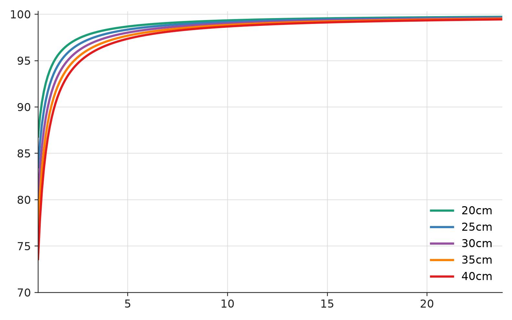

# 20cm / 25cm / 30cm / 35cm / 40cm baseline 视场重叠分析 - 2026-07-13

## 1. 分析口径

视场重叠用来判断目标是否能同时进入左右相机画面。目标处在共同视场内时，深度误差仍按双目三角化模型计算；目标离开共同视场时，双目没有足够观测条件。这里把视场重叠作为可用区域约束，比较 `20cm`、`25cm`、`30cm`、`35cm`、`40cm` 五种 baseline 的水平共同视场。

## 2. 水平 FOV 估计

深度误差分析使用的 4K 等效像素焦距为 `1266.934 px`，图像宽度为 `3840 px`。由像素焦距反推水平半视场角和水平 FOV：

$$
\begin{aligned}
f &= 1266.934 \text{ px} \\
W &= 3840 \text{ px} \\
\alpha
&= \arctan\left(\frac{W}{2f}\right)
= \arctan\left(\frac{3840}{2 \cdot 1266.934}\right)
= 56.58^\circ \\
HFOV
&= 2\alpha
= 113.16^\circ \\
\tan(\alpha)
&= 1.515
\end{aligned}
$$

镜头标称 `FOV120` 会得到更大的重叠比例。这里用当前 `f` 反推得到的 `113.16°`，结果更保守，也和深度误差计算使用的焦距保持一致。

## 3. 平行双目重叠模型

假设两相机光轴平行，baseline 沿水平方向，目标距离为 `Z`。单相机在距离 `Z` 处的水平覆盖宽度、左右相机的共同覆盖宽度和共同视场比例可以连起来写成：

$$
\begin{aligned}
W_{single}(Z)
&= 2Z \tan(\alpha)
= 2Z \cdot 1.515
= 3.031Z \\
W_{overlap}(Z, B)
&= W_{single}(Z) - B
= 3.031Z - B \\
R_{overlap}(Z, B)
&= \frac{W_{overlap}}{W_{single}}
= 1 - \frac{B}{3.031Z}
\end{aligned}
$$

当共同覆盖宽度刚好为零时，可以得到最小重叠距离：

$$
Z_{min} = \frac{B}{3.031}
$$

五种 baseline 对应的最小重叠距离都远小于正常网球观测距离。

| baseline | 最小重叠距离 |
|---|---:|
| 20cm | 0.066 m |
| 25cm | 0.083 m |
| 30cm | 0.099 m |
| 35cm | 0.116 m |
| 40cm | 0.132 m |

## 4. 共同视场比例

共同视场比例随距离变化。baseline 越大，共同视场比例越小；距离越远，baseline 占视场宽度的比例越小，共同视场差异也越小。

| 距离 | 20cm | 25cm | 30cm | 35cm | 40cm |
|---:|---:|---:|---:|---:|---:|
| 0.5m | 86.8% | 83.5% | 80.2% | 76.9% | 73.6% |
| 1m | 93.4% | 91.8% | 90.1% | 88.4% | 86.8% |
| 2m | 96.7% | 95.9% | 95.1% | 94.2% | 93.4% |
| 5m | 98.7% | 98.4% | 98.0% | 97.7% | 97.4% |
| 10m | 99.3% | 99.2% | 99.0% | 98.8% | 98.7% |
| 20m | 99.7% | 99.6% | 99.5% | 99.4% | 99.3% |
| 23.77m | 99.7% | 99.7% | 99.6% | 99.5% | 99.4% |

`5m` 以后，五种 baseline 的共同视场比例都超过 `97%`。在 `5m`、`10m`、`15m`、`20m`、`23.77m` 这些距离点，视场重叠对深度误差表的影响很小，主要误差仍来自视差误差、焦距不确定性和 baseline 安装误差。

近距离时差异更明显。`0.5m` 处，30cm 的共同视场比例约 `80.2%`，40cm 降到 `73.6%`；`1m` 处分别为 `90.1%` 和 `86.8%`；`2m` 处分别为 `95.1%` 和 `93.4%`。因此，非常近距离的双目观测会更受大 baseline 影响；网球中远距离定位中，30cm、35cm、40cm 的共同视场差异较小。

## 5. 有效水平范围

如果目标相对双目中心线的水平偏移为 `x`，共同视场内的有效条件为：

$$
|x| \leq Z\tan(\alpha) - \frac{B}{2}
$$

baseline 取 30cm 和 40cm 时，有效水平范围分别写成：

$$
\begin{aligned}
B = 0.30m:\quad |x| &\leq 1.515Z - 0.15 \\
B = 0.40m:\quad |x| &\leq 1.515Z - 0.20
\end{aligned}
$$

把这个条件代入几个典型距离，可以得到共同视场半宽。

| 距离 | 30cm 共同视场半宽 | 40cm 共同视场半宽 |
|---:|---:|---:|
| 2m | 2.88 m | 2.83 m |
| 5m | 7.43 m | 7.38 m |
| 10m | 15.00 m | 14.95 m |
| 20m | 30.15 m | 30.10 m |

`5m` 以后，40cm 仍有很宽的共同视场。对中远距离深度误差来说，视场重叠不是限制 35cm 和 40cm 的主要因素；实际更需要验证的是更长结构带来的机械刚性、外参稳定性和重新标定后的残差。
