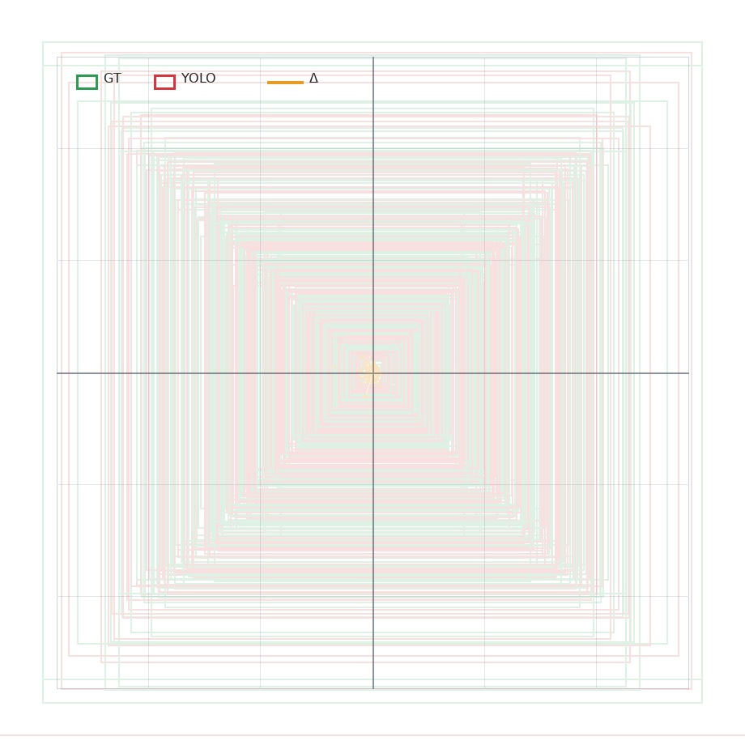
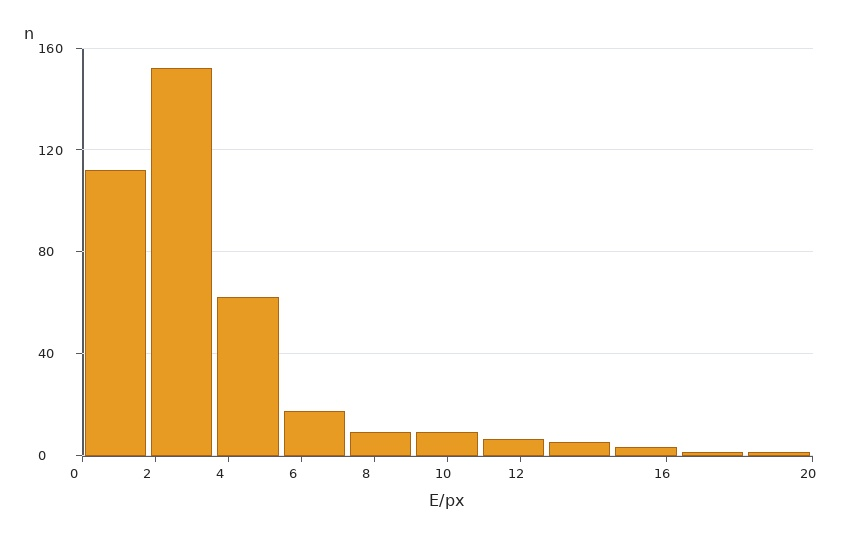
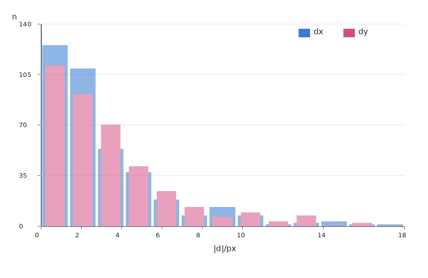
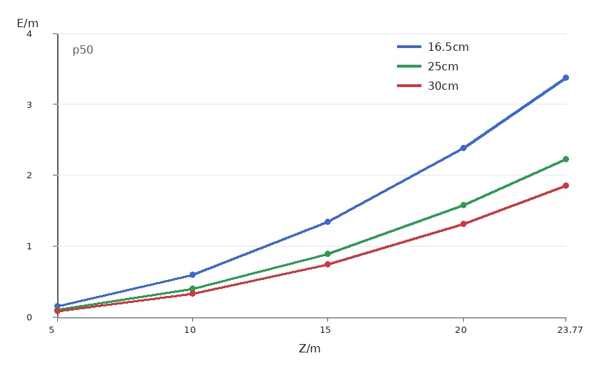
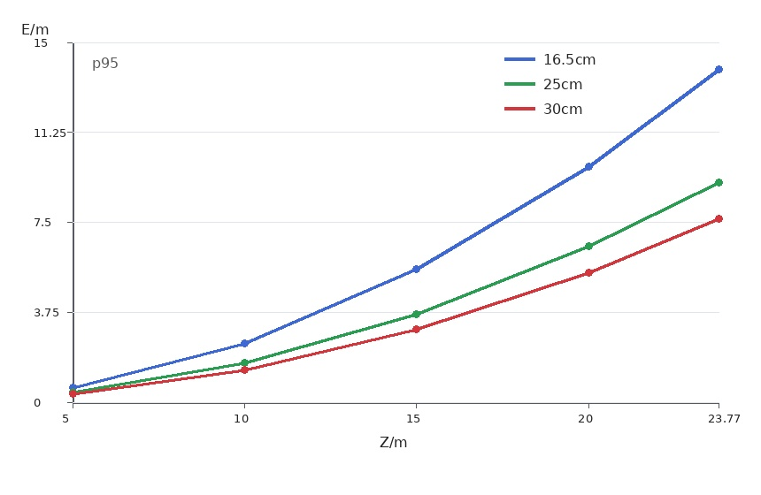
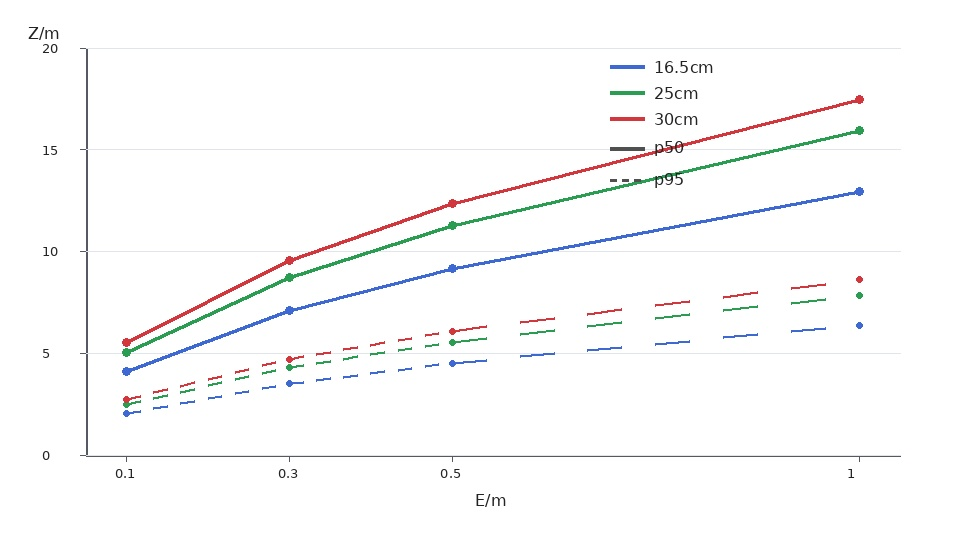

# Baseline 对落点预测误差预算 - 2026-07-13

## Scope

本文把当前可用的三类数据合在一起，估算不同双目 baseline 下的落点预测误差下限：

- 当前双目标定数据；
- 当前 4K YOLO 检测成功样本的中心偏移统计；
- YOLO 偏移可视化图。

这不是实测落点验证。当前没有带真实落点 ground truth 的同步双目轨迹数据，因此本文只给出“由双目三角化输入误差导致的落点误差预算 / 下限估算”。真实落点预测还会额外叠加轨迹拟合、时间同步、空气阻力、旋转、相机姿态到球场坐标转换等误差。

## Input Data

### Calibration

标定包：

- `artifacts/calibration/cam1`
- `artifacts/calibration/cam2`
- `artifacts/calibration/stereo_cam1_cam2`

关键数据：

| item | value |
|---|---:|
| cam1 `new_camera_matrix.fx` | 436.299 px |
| cam2 `new_camera_matrix.fx` | 408.324 px |
| mean rectified proxy focal length at 1280x720 | 422.311 px |
| scaled focal length at 3840x2160 | 1266.934 px |
| current stereo baseline | 0.164989 m |
| stereo RMS reprojection error | 0.212 px at 1280x720 |
| scaled stereo RMS at 3840x2160 | 0.636 px |
| epipolar RMS | 0.257 px |
| rectification y p95 | 0.430 px |

说明：当前 calibration image size 是 `1280x720`，YOLO 评测图像是 `3840x2160`。本文按同一视场/裁切假设把焦距和 stereo RMS 按 `3x` 缩放到 4K 图像坐标。后续如果用最终 4K 模式重新标定，应替换这里的 `f = 1266.934 px`。

### YOLO Center Offset

YOLO 偏移报告：

- `docs/current/yolo_center_offset_iou50_result_20260713.md`
- `docs/current/assets/baseline_yolo_overlay_clean_20260713.jpg`
- `docs/current/assets/baseline_yolo_center_hist_clean_20260713.jpg`
- `docs/current/assets/baseline_yolo_dxdy_hist_clean_20260713.jpg`

评测口径：

- dataset split: `tools/yolo/workspace/runs/combined_current_fixed_cloudy_20260707/val.txt`
- image size: `3840x2160`
- model: `artifacts/models/tennis_ball_yolo/model.pt`
- inference `imgsz=1280`
- confidence threshold: `0.05`
- 只统计 `IoU >= 0.5` 的准确匹配框；
- 不统计漏检、错检、明显偏移框。

关键数据：

| metric | p50 | p95 |
|---|---:|---:|
| center_error_px | 1.431 px | 5.673 px |
| abs_dx_px | 0.759 px | 3.606 px |
| abs_dy_px | 0.889 px | 4.243 px |

下面几张图只放图形本身，解释文字放在正文中。图内保留的 `GT`、`YOLO`、`dx`、`dy`、`p50`、`p95`、`px`、`m`、`cm`、`n` 均为缩写或单位。

第一张图把所有 `IoU >= 0.5` 的准确匹配框重新对齐到人工 bbox 中心后叠在一起。绿色框表示人工 bbox，红色框表示 YOLO bbox，黄色点/线表示 YOLO 中心相对人工中心的偏移。



第二张图是准确匹配框的中心偏移 `E = sqrt(dx^2 + dy^2)` 分布。它只描述“已经检测准确时”的中心偏移，不包含漏检或错检。



第三张图把 `abs(dx)` 和 `abs(dy)` 的分布叠在一起，用于判断三角化更敏感的 x 方向误差量级。



## Error Model

三角化深度：

```text
Z = f * B / d
```

深度误差近似：

```text
depth_error ≈ Z^2 / (f * B) * disparity_error
```

其中：

- `Z`: 球到相机的距离，单位 m；
- `f`: 4K 等效像素焦距，本文取 `1266.934 px`；
- `B`: baseline，单位 m；
- `d`: disparity，单位 px；
- `disparity_error`: 左右图 x 方向中心误差合成。

YOLO 检测成功后的 disparity 误差估计：

```text
disparity_error_yolo ≈ sqrt(2) * abs_dx
```

再叠加标定几何残差：

```text
disparity_error_combined ≈ sqrt(disparity_error_yolo^2 + stereo_rms_4k^2)
```

得到：

| case | YOLO disparity error | combined disparity error |
|---|---:|---:|
| p50 | 1.073 px | 1.247 px |
| p95 | 5.100 px | 5.139 px |

为了把高度纳入落点预算，本文额外使用一个简化弹道敏感度项：

```text
height_to_landing_error ≈ horizontal_speed / sqrt(vertical_speed^2 + 2 * g * height) * height_error
```

本文取一个固定读数场景：

- ball height: `1.0m`
- horizontal speed: `10m/s`
- vertical speed: `-4m/s`
- `g = 9.81m/s^2`

对应系数约为：

```text
height_to_landing_error ≈ 1.68 * height_error
```

在当前 YOLO 偏移数据下，落点误差预算仍然主要由深度误差主导，高度项是次要项。

## Baseline Scenarios

本文比较三种 baseline：

| scenario | baseline |
|---|---:|
| current measured | 0.164989 m |
| proposed 25cm | 0.250000 m |
| proposed 30cm | 0.300000 m |

理论上，在其他条件不变时，深度误差与 baseline 近似成反比：

| change | error factor | reduction |
|---|---:|---:|
| current 16.5cm -> 25cm | 0.660x | 34.0% |
| current 16.5cm -> 30cm | 0.550x | 45.0% |
| 25cm -> 30cm | 0.833x | 16.7% |

## Estimated Landing Error Floor

下面表格是综合 YOLO 偏移和标定残差后的落点误差下限估算，单位为 m。它不是实际落点误差实测值。

### p50 YOLO Offset Case

| baseline | 5m | 10m | 15m | 20m | 23.77m |
|---|---:|---:|---:|---:|---:|
| current 16.5cm | 0.15 | 0.60 | 1.34 | 2.39 | 3.37 |
| 25cm | 0.10 | 0.39 | 0.89 | 1.58 | 2.23 |
| 30cm | 0.08 | 0.33 | 0.74 | 1.31 | 1.85 |

下图对应 p50 偏移场景。三条曲线分别是当前 `16.5cm`、`25cm` 和 `30cm` baseline 的落点误差下限随距离增长的趋势。



### p95 YOLO Offset Case

| baseline | 5m | 10m | 15m | 20m | 23.77m |
|---|---:|---:|---:|---:|---:|
| current 16.5cm | 0.62 | 2.46 | 5.53 | 9.84 | 13.89 |
| 25cm | 0.41 | 1.62 | 3.65 | 6.49 | 9.17 |
| 30cm | 0.34 | 1.35 | 3.04 | 5.41 | 7.64 |

下图对应 p95 偏移场景。它展示的是成功检测样本中偏移较大的尾部情况，因此远场误差增长明显更快。



读数：

- 25cm 到 30cm 有稳定收益，但只降低约 `16.7%`。
- 远场误差按 `Z^2` 增长，20m 以后误差快速放大。
- 在当前 YOLO 成功检测后的像素偏移统计下，baseline 增大不能单独把远场落点误差压到厘米级。

## Distance Limits Under Error Targets

下面表格回答“在当前误差模型下，达到某个落点误差目标最多能看多远”。单位为 m。

### p50 Case

| error target | current 16.5cm | 25cm | 30cm |
|---|---:|---:|---:|
| <= 0.10m | 4.1 | 5.0 | 5.5 |
| <= 0.30m | 7.1 | 8.7 | 9.6 |
| <= 0.50m | 9.2 | 11.3 | 12.3 |
| <= 1.00m | 12.9 | 15.9 | 17.5 |

### p95 Case

| error target | current 16.5cm | 25cm | 30cm |
|---|---:|---:|---:|
| <= 0.10m | 2.0 | 2.5 | 2.7 |
| <= 0.30m | 3.5 | 4.3 | 4.7 |
| <= 0.50m | 4.5 | 5.6 | 6.1 |
| <= 1.00m | 6.4 | 7.9 | 8.6 |

下图把不同误差目标下的最大可用距离画成曲线。实线表示 p50，虚线表示 p95；颜色表示 baseline。



## Interpretation

1. `30cm` baseline 比 `25cm` 更好，但不是数量级变化。

   在同样焦距和 YOLO 偏移下，30cm 相对 25cm 的误差约为 `0.25 / 0.30 = 83.3%`。也就是只降低约 `16.7%`。

2. 当前主要瓶颈是远距离视差误差。

   当前准确匹配框的 `abs_dx p50 = 0.759px`，左右相机合成后已是约 `1.073px` 的 disparity 误差；再叠加标定残差后 p50 combined disparity error 约 `1.247px`。这个量级对远场三角化非常敏感。

3. 4K 有帮助，但 FOV / 焦距仍然决定远场能力。

   本文使用由现有标定缩放得到的 `f ≈ 1267px`。如果最终镜头真实水平 FOV 是 `120°`，则 `3840px` 宽度下等效 `f ≈ 1109px`，误差会比本文表格再放大约 `1267 / 1109 ≈ 1.14x`。

4. 高度已经纳入预算，但在当前数据下不是主导项。

   高度误差通过落地时间影响水平落点；本文使用 `z=1m`、水平速度 `10m/s`、竖直速度 `-4m/s` 的简化模型。结果上，深度误差远大于高度项。

5. 不能把本文当成真实落点预测验证。

   本文没有使用真实落点 ground truth，也没有验证轨迹拟合和 ROS/Gazebo 闭环。它只能说明当前视觉输入误差在不同 baseline 下会给落点预测带来的理论下限压力。

## Recommendation

- 如果硬件允许，`30cm` baseline 优于 `25cm`，但收益只有约 `16.7%`，不要期待它单独解决远场误差。
- 如果目标是标准球场远端稳定接球，优先级应是：
  1. 提高有效焦距或降低 FOV；
  2. 降低 YOLO 球心 x 方向偏移；
  3. 做最终 4K 分辨率、最终 baseline、最终镜头的真实双目标定；
  4. 采集同步双目轨迹和真实落点 ground truth，做真实落点误差统计。
- 对于现阶段方案选择，`30cm baseline + 更高有效焦距 + 轨迹时序滤波` 比单纯 `25cm -> 30cm` 更关键。

## Required Data for Real Landing Validation

要把本文从误差预算升级成真实落点预测报告，还需要：

- 最终 25cm / 30cm 机械安装后的双目标定包；
- 4K 原始分辨率下的 `camera_matrix` / `new_camera_matrix` / stereo rectification；
- 同步双目视频，包含真实飞行轨迹；
- 每条轨迹的真实落点 ground truth；
- 相机到球场坐标系的外参；
- 每帧 ROS timestamp / camera timestamp；
- 轨迹拟合输出的 predicted landing point；
- predicted landing point 与 ground truth landing point 的 p50 / p90 / p95 / max 误差。
