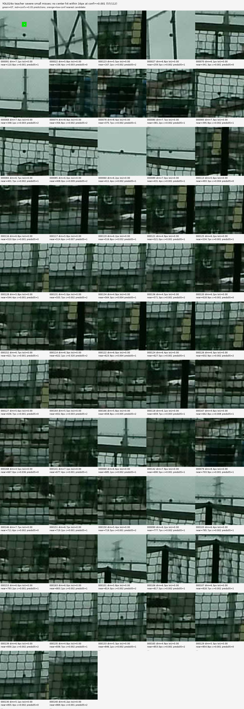
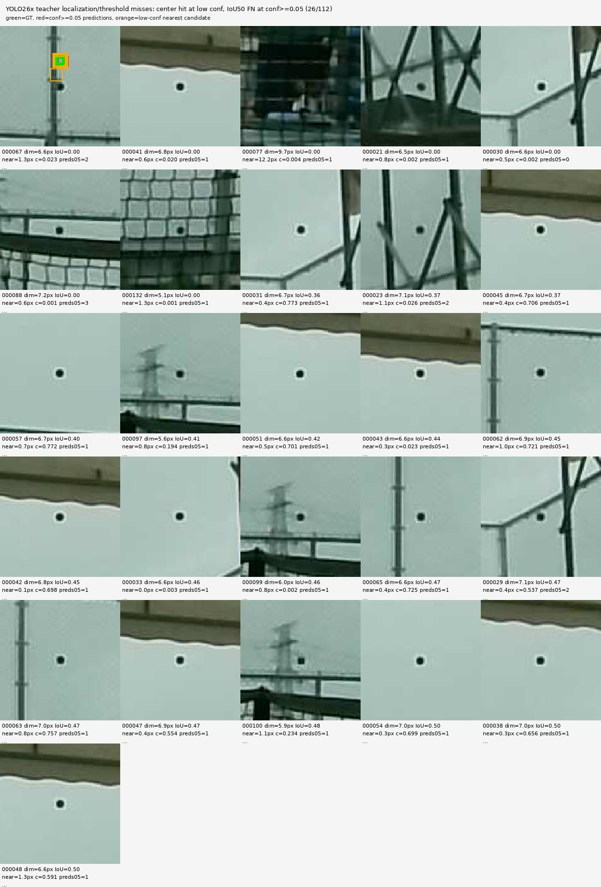
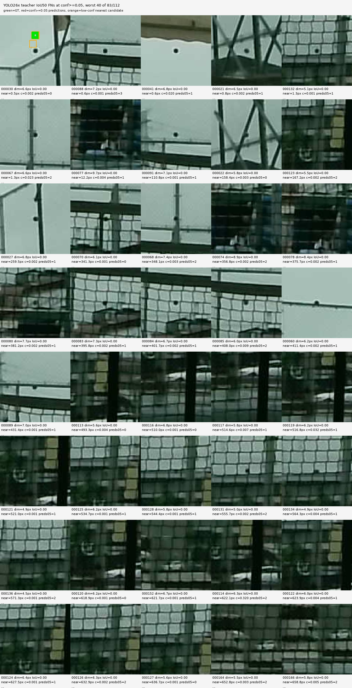

# YOLO26x Teacher Miss Contact Sheet - 2026-07-09

## Current Situation

The trained `yolo26x` teacher is useful as a candidate generator for medium and
large balls, but it still misses many tiny fixed-exposure balls.

Frozen small benchmark, 112 images:

| metric | result |
|---|---:|
| IoU50 hits at `conf=0.05` | `29 / 112` |
| IoU50 misses at `conf=0.05` | `83 / 112` |
| center-16 hits at `conf=0.001` | `55 / 112` |
| no center-16 candidate at `conf=0.001` | `57 / 112` |
| center hit at low conf but IoU50 miss at `conf=0.05` | `26 / 112` |
| median GT max dimension | `6.64 px` |

So the low recall is not only a confidence-threshold problem. More than half of
the small benchmark samples have no candidate within `16 px` of the labeled ball
even at `conf=0.001`.

## Why Recall Is Low

The previous reports already explained the main cause:

- `docs/current/yolo_small_recall_diagnosis_20260709.md` showed that small
  benchmark balls are mostly `4-8 px`, with median `6.64 px`.
- At `imgsz=1536`, those balls become roughly `5 px` in model input.
- Non-P2 YOLO heads start at stride `8`, so a ball can be smaller than one
  finest-head cell.
- P2 helps, but even P2 still misses many samples, meaning the issue is also
  real-domain signal quality and background clutter, not only model size.
- `docs/current/yolo26x_teacher_candidate_result_20260709.md` showed that a
  much larger P3/P4/P5 model improves recall only slightly.

The contact sheets below add visual confirmation: many misses are tiny dark or
weak spots around net lines, poles, roof edges, or dark background clutter. In
those cases the nearest low-confidence prediction is often tens to hundreds of
pixels away from GT.

## Severe Misses

These are samples with no candidate center within `16 px` even at
`conf>=0.001`.

Green is GT. Red is `conf>=0.05` prediction. Orange is the nearest low-conf
candidate when it appears inside the crop.

Readout:

- This is the important failure class.
- Lowering the threshold does not recover these because the model response is
  not near the ball.
- The ball often looks like a 5-7 px dot on net/court structure.

## Localization And Threshold Misses

These are samples with a low-confidence center hit, but no IoU50 match at
`conf>=0.05`.

Readout:

- Some balls are visually obvious in the crop, but the box is too low-confidence
  or slightly mis-sized.
- For a 6 px GT box, a 1-2 px center or size error can fail IoU50.
- Center-based tracking metrics are more forgiving than IoU50 for first
  acquisition, but this does not solve the severe no-response group.

## Worst IoU50 Misses

This sheet shows the worst 40 IoU50 false negatives at `conf>=0.05`.

## Artifacts

| artifact | path |
|---|---|
| severe miss sheet | `docs/current/assets/yolo26x_teacher_small_no_center16_conf0001_20260709.jpg` |
| localization miss sheet | `docs/current/assets/yolo26x_teacher_small_center_hit_but_iou50_fn_conf005_20260709.jpg` |
| worst IoU50 miss sheet | `docs/current/assets/yolo26x_teacher_small_iou50_fn_conf005_top40_20260709.jpg` |
| per-image rows | `docs/current/assets/yolo26x_teacher_small_miss_rows_20260709.csv` |
| summary JSON | `docs/current/assets/yolo26x_teacher_small_miss_summary_20260709.json` |

## Decision

The current recall is low because the hard benchmark is dominated by true tiny
single-frame detection failures, not because the threshold is simply too high.

Useful next steps:

1. Add more real fixed-exposure labels specifically for 4-8 px balls near
   net/poles/dark backgrounds.
2. Mine hard negatives from the same structures.
3. If continuing the YOLO teacher path, use a P2-enabled teacher rather than
   only a larger P3/P4/P5 model.
4. Keep center-hit metrics next to IoU50 for runtime acquisition.
