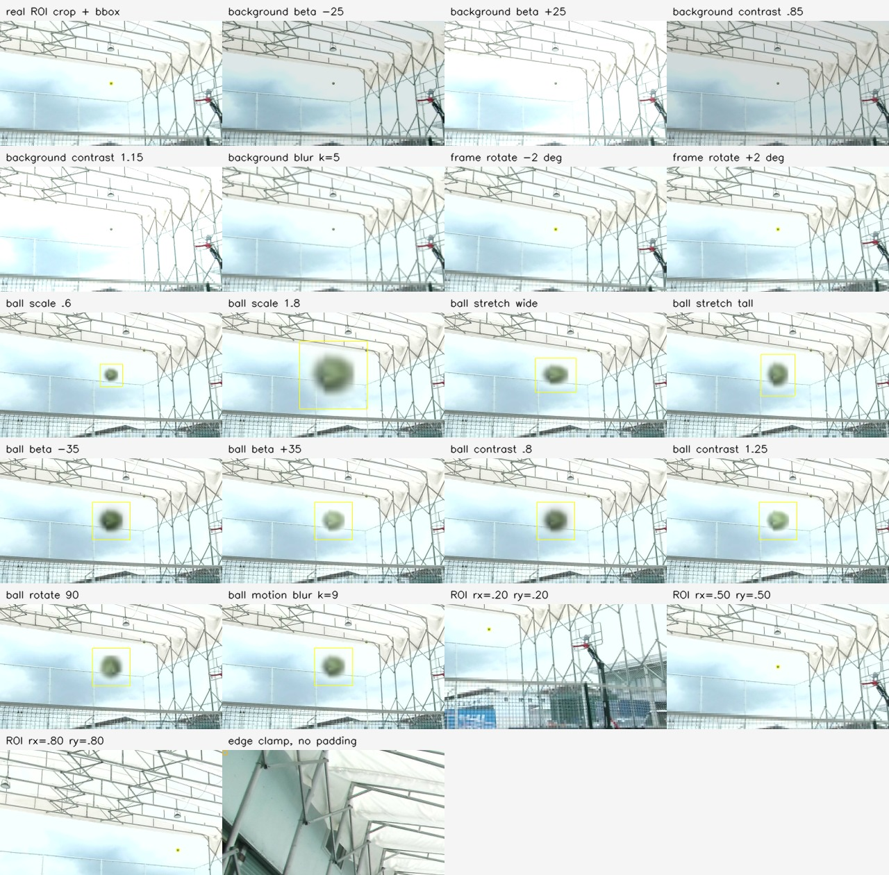

# YOLO Augmentation Scheme Review - 2026-07-07

## Scope

This note summarizes the current YOLO augmentation paths and records a visual
collage generated from real project samples.

It describes data generation and training augmentation only. It does not
validate ROS/Gazebo, stereo triangulation, trajectory prediction, or chassis
control.

Visual example:



## Current Custom Copy-Paste Augmentation

The active custom generator is `copy_paste`, configured by
`tools/yolo/configs/augmentation.toml` and the run-specific TOML files under
`tools/yolo/workspace/runs/`.

The two training runs used the same transform ranges:

| parameter | value |
|---|---:|
| pasted balls per image | `1` |
| prefer negative backgrounds | `true` |
| require label-file backgrounds | `true` in training runs |
| generated positives | `900` in the 1000 trial; `4500` in the 0260701 run |
| generated negatives | `100` in the 1000 trial; `500` in the 0260701 run |
| include original labeled images | `true` |
| validation ratio | `0.1` |
| JPEG quality | `92` |

Background transforms:

| parameter | value |
|---|---:|
| brightness beta | `[-25, 25]` |
| contrast alpha | `[0.85, 1.15]` |
| Gaussian blur probability | `0.10` |
| Gaussian blur kernel | `[3, 5]` |

Frame-level transform after paste:

| parameter | value |
|---|---:|
| rotation probability | `0.35` |
| rotation degrees | `[-2.0, 2.0]` |
| rotation border mode | reflected border |

Ball sprite transforms:

| parameter | value |
|---|---:|
| scale | `[0.6, 1.8]` |
| stretch x | `[0.9, 1.1]` |
| stretch y | `[0.9, 1.1]` |
| brightness beta | `[-35, 35]` |
| contrast alpha | `[0.8, 1.25]` |
| rotation degrees | `[-180, 180]` |
| motion blur probability | `0.20` |
| motion blur kernel | `[3, 9]` |
| alpha threshold for bbox | `16` |
| minimum visible area | `12 px` |
| avoid existing bbox IoU | `0.02` |

Important implementation detail: sprite rotation is only enabled when the
selected background is an empty negative frame. The generator sets
`allow_rotation = background_record.is_negative` before transforming the
sprite.

The custom copy-paste path does not currently have explicit HSV, saturation,
gamma, noise, vertical flip, or horizontal flip settings. It uses brightness,
contrast, blur, small frame rotation, sprite scale/stretch/brightness/contrast,
sprite rotation on negative backgrounds, and sprite motion blur.

## Current ROI Crop Dataset

The ROI crop dataset used for the ROI detector is:

`tools/yolo/workspace/runs/roi_crop_960x540_imgsz320_20260704`

Its report records:

| parameter | value |
|---|---:|
| crop size | `960x540` |
| margin | `24 px` |
| desired ball x ratios | `0.20, 0.35, 0.50, 0.65, 0.80` |
| desired ball y ratios | `0.20, 0.35, 0.50, 0.65, 0.80` |
| max positive crops per source box | `8` |
| negative crop target ratio | `0.5` |
| negative IoU rejection threshold | `0.01` |

Yes: one labeled ball can produce many ROI crops, so the same ball appears in
different parts of the crop. The 5 x 5 ratio grid gives up to 25 desired crop
placements per source bbox, then the generator caps accepted positives at 8 per
source box to avoid one easy frame dominating the dataset.

Generated counts from the recorded run:

| item | count |
|---|---:|
| labeled source images scanned | `693` |
| positive crops | `2337` |
| negative crops | `1168` |
| train images | `2804` |
| val images | `701` |

## Boundary Handling

Current ROI crop training data does not use synthetic padding. The recorded
dataset report states:

```text
Crops stay fully inside real source images; no padding is used.
```

So if the desired ROI would go outside the source frame, the current policy is
to keep the crop inside real pixels. Depending on the generator path, that means
invalid desired positions are skipped or the runtime crop is clamped into the
image. In either case, there are no unfilled pixels inside the generated crop.

For runtime, `crop_bounds()` clamps the crop rectangle into the real image:

```text
x1 = min(max(0, x1), frame_width - crop_width)
y1 = min(max(0, y1), frame_height - crop_height)
```

If future training needs a ball exactly at the ROI border while the crop would
extend outside the source frame, the preferred policy should be explicit:

- first choice: skip that crop for clean ROI detector training;
- second choice for a dedicated edge-case experiment: use reflect or replicate
  padding and write it into metadata;
- avoid black or constant-color padding, because it creates a border artifact
  that will not exist in normal runtime crops.

## Ultralytics Training Augmentation

The YOLO training runs also used Ultralytics' training-time augmentation defaults
recorded in `args.yaml`.

Relevant values from both the copy-paste training and ROI crop training runs:

| parameter | value |
|---|---:|
| `hsv_h` | `0.015` |
| `hsv_s` | `0.7` |
| `hsv_v` | `0.4` |
| `degrees` | `0.0` |
| `translate` | `0.1` |
| `scale` | `0.5` |
| `shear` | `0.0` |
| `perspective` | `0.0` |
| `flipud` | `0.0` |
| `fliplr` | `0.5` |
| `mosaic` | `1.0`, with `close_mosaic=10` |
| `mixup` | `0.0` |
| `cutmix` | `0.0` |
| `copy_paste` | `0.0` |
| `auto_augment` | `randaugment` |
| `erasing` | `0.4` |

This is separate from the custom dataset generator. The custom generator writes
new images to disk; Ultralytics applies these training-time transforms while
loading batches.

## Visual Collage

The collage was generated from:

- real source frame:
  `tools/yolo/workspace/dataset/images/0260701/20260701_154019_cam1_frame_000001.jpg`;
- real label:
  `tools/yolo/workspace/dataset/labels/0260701/20260701_154019_cam1_frame_000001.txt`;
- real negative background:
  `tools/yolo/workspace/dataset/images/0260701/20260701_154019_cam1_frame_000204.jpg`;
- approved sprite:
  `tools/yolo/workspace/runs/sprites/approved/0260701_20260701_154019_cam1_frame_000001__box00.png`.

The visual is illustrative. It does not add images to a training split and does
not change any label files.

## Readout

The current data story is:

1. Full-frame copy-paste creates more labeled balls and negatives, with moderate
   color/blur/rotation variation.
2. ROI crop training deliberately changes where the same real labeled ball sits
   inside a crop. That is the part that directly supports ROI-first runtime.
3. Edge or border cases currently avoid unfilled pixels by staying inside real
   image content. Padding is not part of the current trained dataset.
4. If the next runtime direction is ROI-first, the next useful augmentation work
   is not more full-frame brightness variation; it is more ROI-shaped real
   crops, controlled edge-case crops, and high-resolution tile crops that match
   the search fallback.
