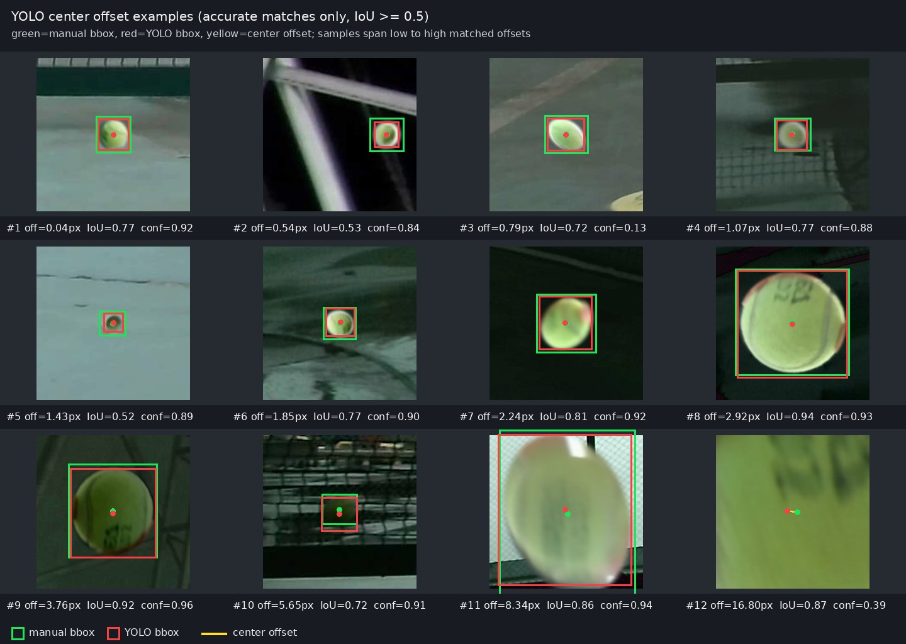

# YOLO Center Offset Result - 2026-07-13

## Scope

This report measures YOLO center offset only for detections that were already
accurate enough to match a manual bbox. It intentionally excludes missed balls,
unmatched predictions, and visibly wrong detections from the offset statistics.

This is a detector-center-offset measurement, not a recall or triangulation
validation.

## Inputs

- Dataset split: `tools/yolo/workspace/runs/combined_current_fixed_cloudy_20260707/val.txt`
- Model: `artifacts/models/tennis_ball_yolo/model.pt`
- Inference image size: `1280`
- Confidence threshold: `0.05`
- NMS IoU threshold: `0.5`
- Device: `cuda:0`
- Accurate-match rule: prediction and manual bbox are matched only when
  `IoU >= 0.5`.

## Dataset Readout

| item | count |
|---|---:|
| validation images | 975 |
| positive images | 792 |
| ground-truth boxes | 792 |
| predicted boxes | 546 |
| accurate matched boxes, IoU >= 0.5 | 377 |

Only the `377` accurate matched boxes below are included in the offset metrics.

## Center Offset Metrics

Definitions:

- `dx_px = predicted_center_x - manual_bbox_center_x`
- `dy_px = predicted_center_y - manual_bbox_center_y`
- `center_error_px = sqrt(dx_px^2 + dy_px^2)`

| metric | n | mean | RMS | p50 | p75 | p90 | p95 | max |
|---|---:|---:|---:|---:|---:|---:|---:|---:|
| center_error_px | 377 | 1.970 | 2.813 | 1.431 | 2.245 | 3.768 | 5.673 | 16.803 |
| abs_dx_px | 377 | 1.195 | 2.007 | 0.759 | 1.491 | 2.426 | 3.606 | 16.652 |
| abs_dy_px | 377 | 1.307 | 1.971 | 0.889 | 1.623 | 2.606 | 4.243 | 10.994 |
| signed_dx_px | 377 | -0.383 | 2.007 | -0.241 | 0.506 | 1.282 | 1.854 | 13.724 |
| signed_dy_px | 377 | -0.114 | 1.971 | -0.275 | 0.773 | 1.693 | 2.924 | 10.994 |

## Visual Summary

The montage below shows 12 representative accurate matches across the matched
offset distribution. Each crop is centered around the ball region.

- Green box: manual bbox.
- Red box: YOLO bbox.
- Yellow line: center offset from manual bbox center to YOLO bbox center.



## Matched Box Size Buckets

| GT max bbox dimension | matches | center p50 | center p90 | center p95 | abs dx p50 | abs dy p50 |
|---|---:|---:|---:|---:|---:|---:|
| 6-10 px | 1 | 1.042 | 1.042 | 1.042 | 0.053 | 1.041 |
| 10-20 px | 25 | 0.974 | 1.622 | 1.770 | 0.531 | 0.437 |
| >=20 px | 351 | 1.497 | 3.932 | 5.779 | 0.775 | 0.919 |

There were no accurate `IoU >= 0.5` matches in the `<6 px` bucket for this run.

## Readout

- For already accurate YOLO boxes, the median center offset is about `1.43 px`.
- The p95 center offset is about `5.67 px`; this tail remains relevant if the
  downstream stereo pipeline cannot reject high-offset but still IoU-valid
  boxes.
- The median signed bias is small: `dx=-0.24 px`, `dy=-0.28 px`.
- This result should not be used as detector recall. Missed balls and wrong
  detections were deliberately excluded by the requested evaluation scope.

## Command

The measurement was run with `uv` and Ultralytics using GPU device `0`.

```bash
uv run --project tools/yolo python <inline center-offset evaluator>
```
