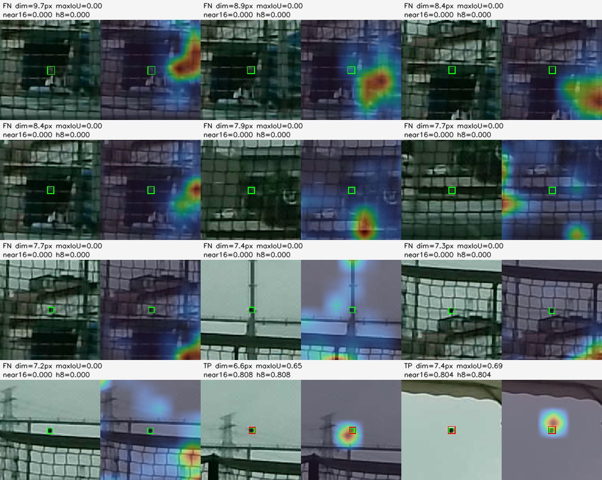
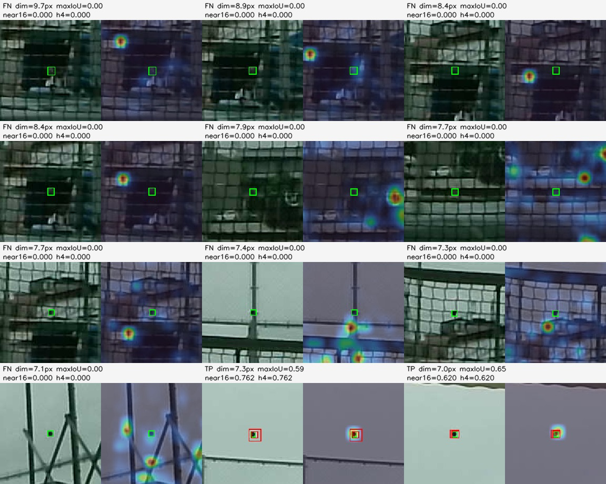

# YOLO Small-Object Recall Diagnosis - 2026-07-09

## Scope

This note summarizes the current evidence for why full-frame YOLO recall is
poor on tiny fixed-exposure tennis balls. It combines the prior training runs
with a new benchmark-only failure diagnosis using low-threshold predictions and
YOLO26 class-head heatmaps.

This is detector-only. It does not validate stereo triangulation, trajectory
prediction, real ROS/chassis, or chassis control.

## Models Checked

| model | heads | key training change | small recall, final raw benchmark |
|---|---|---|---:|
| non-P2 tiny copy-paste | P3/P4/P5, stride `8/16/32` | final trainpool plus 6k tiny copy-paste samples | `0.080` at `imgsz=1536`, `conf=0.05` |
| P2 no-P5 | P2/P3/P4, stride `4/8/16` | same trainpool, stride-4 head, no P5 | `0.232` at `imgsz=1536`, `conf=0.05` |
| non-P2 low-light full-frame | P3/P4/P5 | train/test CLAHE plus gamma | `0.009` to `0.045` small recall depending checkpoint |
| fixed ROI low-light | P3/P4/P5 | ROI train/test CLAHE plus gamma | recovered mismatch, but did not beat original ROI recall |

The low-light result is recorded in
`docs/current/yolo_non_p2_fullframe_roi_lowlight_result_20260709.md`. It does
not improve the full-frame tiny-ball failure.

## Benchmark Small-Object Distribution

The frozen final raw benchmark small bucket contains only fixed-exposure images
from `20260707_141324_cam1`.

| metric | value |
|---|---:|
| small objects | `112` |
| max box dim min / p25 / median / p75 / max | `4.48 / 6.08 / 6.64 / 6.92 / 9.72 px` |
| objects `<= 5 px` | `8 / 112` |
| objects `<= 7 px` | `88 / 112` |
| objects `<= 8 px` | `108 / 112` |

At `imgsz=1536`, a `1920x1080` frame is effectively resized to about
`1536x864`, so the median `6.64 px` ball becomes about `5.3 px` in model input.
That is less than one stride-8 cell for the non-P2 model, and only about
`1.3` stride-4 cells for the P2 model.

## Diagnostic Method

For the 112 benchmark small objects:

1. Run each model at `imgsz=1536`, `conf=0.001`, `iou=0.7`, `max_det=300`.
2. Measure normal IoU recall at `conf=0.05` and `0.25`.
3. Also measure center-hit recall within `16 px` and `32 px`, because IoU `0.5`
   is extremely sensitive for 5-7 px boxes.
4. Hook the YOLO26 `end2end=True` one-to-one class head and record the class
   heatmap score around the ground-truth center on the finest stride.

Raw artifacts:

| artifact | path |
|---|---|
| summary JSON | `docs/current/assets/yolo_small_recall_diagnosis_summary_20260709.json` |
| non-P2 rows | `docs/current/assets/yolo_small_recall_non_p2_rows_20260709.csv` |
| P2 rows | `docs/current/assets/yolo_small_recall_p2_no_p5_rows_20260709.csv` |
| non-P2 contact sheet | `docs/current/assets/yolo_small_recall_non_p2_contact_sheet_20260709.jpg` |
| P2 contact sheet | `docs/current/assets/yolo_small_recall_p2_no_p5_contact_sheet_20260709.jpg` |

## Low-Threshold Candidate Results

| model | IoU50 @ .05 | center16 @ .05 | IoU50 @ .001 | IoU30 @ .001 | center16 @ .001 | median max IoU | median near16 conf |
|---|---:|---:|---:|---:|---:|---:|---:|
| non-P2 | `9/112 = 0.080` | `41/112 = 0.366` | `10/112 = 0.089` | `40/112 = 0.357` | `43/112 = 0.384` | `0.000` | `0.0000` |
| P2 no-P5 | `26/112 = 0.232` | `43/112 = 0.384` | `32/112 = 0.286` | `48/112 = 0.429` | `49/112 = 0.438` | `0.000` | `0.0000` |

Readout:

- IoU recall under-reports useful localization because tiny boxes are harsh:
  non-P2 has `0.366` center-hit at `conf=0.05` but only `0.080` IoU50 recall.
- This is not only a threshold problem. Even at `conf=0.001`, only `43/112`
  non-P2 samples and `49/112` P2 samples have any candidate within `16 px`.
- P2 improves the number of real IoU50 candidates (`10 -> 32` at low threshold)
  but still leaves most small balls without a usable candidate.

## Class-Head Heatmap Results

Finest one-to-one class-head score at the GT center neighborhood:

| model | finest stride | median local score, TP @ .05 | median local score, FN @ .05 | median percentile, TP | median percentile, FN |
|---|---:|---:|---:|---:|---:|
| non-P2 | `8` | `0.6288` | `0.0000016` | `100.0` | `99.0` |
| P2 no-P5 | `4` | `0.3042` | `0.0000086` | `100.0` | `98.7` |

The percentile is high even for some failures because almost the entire
single-class heatmap is near zero. The absolute score is the important part:
true positives have a strong local class response; most false negatives have
almost no class probability at the ball.

The contact sheets confirm the same pattern. Green boxes are GT, red boxes are
low-threshold detections, and the heat overlay is the finest one-to-one class
head. In many FNs, the head peak is on net/court structure or a nearby high
contrast edge, not on the ball.

## Conclusion

The current small recall bottleneck is mainly a tiny real-domain signal problem,
with a real but secondary model-structure component.

Evidence:

- The benchmark small objects are mostly `6-7 px` fixed-exposure balls against
  net/court clutter. After resize, many are only about `5 px` in model input.
- The non-P2 stride-8 head is too coarse for this regime. P2 helps, proving
  structure matters, but P2 still reaches only `0.232` IoU recall and `0.438`
  low-threshold center-hit coverage.
- Tiny copy-paste data helped only slightly, which points to synthetic-to-real
  appearance mismatch rather than just sample count.
- CLAHE plus gamma domain matching did not improve full-frame small recall.
- Some misses are localization/IoU artifacts, but more than half the benchmark
  small objects still produce no nearby candidate even at `conf=0.001`.

So the answer is not simply "the model is too small" or "add P2". A larger or
better P2 model may help, but the current evidence says the bigger gap is that
the real fixed-exposure tiny-ball appearance is weak and underrepresented:
blurred 4-8 px balls near net lines are often not represented as ball-like by
the class head.

## Recommended Next Steps

1. Label more real fixed-exposure positives where the ball is `4-8 px`,
   especially near net posts, court lines, and dark backgrounds.
2. Add hard negatives from the same net/court structures that currently attract
   heatmap peaks.
3. Train a stronger P2/no-P5 candidate with better initialization or capacity,
   but judge it on this same 112-image small benchmark before promotion.
4. Keep a center/track metric next to IoU for runtime search, because initial
   ROI acquisition can tolerate coarse center localization better than IoU can.
5. Use temporal evidence or a heatmap/keypoint search model for the first
   acquisition stage; single-frame 5 px detection is close to the detector
   limit.

Do not promote the low-light models or the current P2 model as a recall-driven
runtime replacement. P2 is the most promising detector-side direction, but it
needs better real tiny data and/or stronger capacity.
