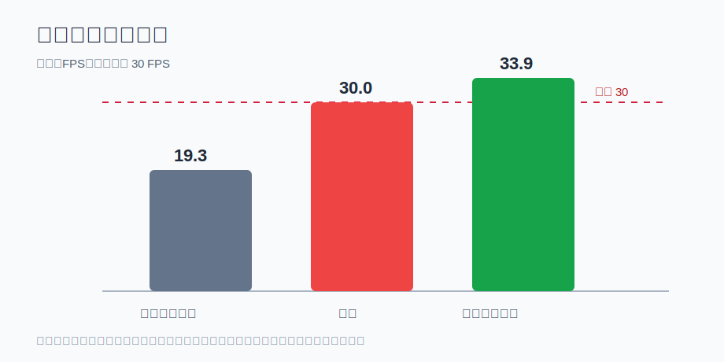
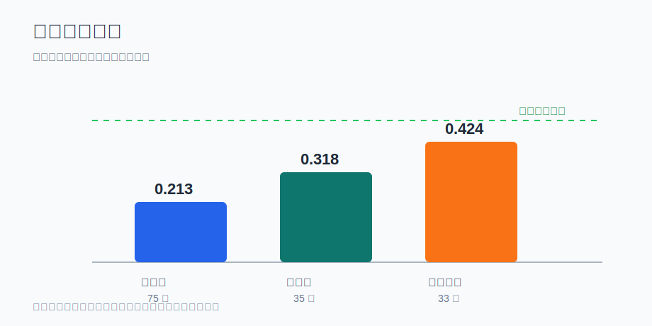

# TennisBot 双周业务工作报告

周期：2026-06-15 至 2026-06-28

## 1. 管理摘要

本周期的核心目标是评估 TennisBot 从实验验证走向实机接球验证的可行性。工作重点集中在三个方面：识别速度是否满足实时要求、远距离小球定位是否具备精度基础、双目相机标定是否达到可继续实机验证的质量。

结论如下：

1. 当前识别链路在边缘计算设备上的稳定速度约为 `19.3 FPS`，低于实时闭环期望的 `30 FPS`，需要继续优化。
2. 远距离接球的主要瓶颈不是单一算法，而是相机间距、成像清晰度和远端小球像素数量。短相机间距不适合作为最终方案。
3. 标定质量已经进入可继续验证阶段，单相机和双目标定结果具备后续实机测试基础。
4. 仿真控制链路已经能产生运动指令，但仿真中的车体位移未按预期发生，真实接球闭环尚未完成。
5. 下一阶段应聚焦在实机视觉闭环、识别速度达标、相机硬件方案确认和移动响应验证。

## 2. 本周期业务目标

| 目标 | 完成情况 | 业务意义 |
| --- | --- | --- |
| 评估远距离接球所需视觉精度 | 已完成阶段性评估 | 明确短相机间距难以覆盖标准场地远端需求 |
| 验证识别速度是否达到实时要求 | 已完成压力测试 | 当前稳定速度不足，需优化后才能进入高可靠闭环 |
| 完成双目相机标定质量评估 | 已完成阶段性标定 | 已具备继续做实机三维定位验证的基础 |
| 验证仿真控制链路 | 部分完成 | 指令链路可用，但运动响应问题仍需解决 |
| 形成下一阶段实机验证路线 | 已完成 | 明确以真实相机、真实标定和真实识别结果为主线推进 |

## 3. 关键量化结果

### 3.1 实时识别速度

实时接球需要识别结果足够快、足够稳定。当前稳定测试表明，现有方案在边缘计算设备上的长期速度约为 `19.3 FPS`，低于 `30 FPS` 目标。

| 指标 | 当前稳定结果 | 目标 | 状态 |
| --- | ---: | ---: | --- |
| 平均识别速度 | 19.3 FPS | 30 FPS | 未达标 |
| 30 分钟测试失败次数 | 0 | 0 | 达标 |
| 平均处理延迟 | 51.76 ms | <=33.33 ms | 未达标 |
| p95 处理延迟 | 54.82 ms | <=33.33 ms | 未达标 |
| 候选优化方案单项测试速度 | 33.86 FPS | 30 FPS | 单项达标，仍需真实场景验证 |

业务解读：当前方案稳定但不够快。候选优化方向在单项测试中已超过 30 FPS，但还需要验证它在真实网球、小球远距离、运动模糊和复杂光照下的识别率。

### 3.2 远距离定位能力

标准网球场全长约 `23.77m`。分析结果显示，相机间距对远距离深度精度影响非常大。

| 相机间距与精度组合 | 保持 <=10cm 深度误差的最大距离 | 对标准球场的意义 |
| --- | ---: | --- |
| 2.8cm 间距 + 0.1px 级误差 | 8.3m | 只能支持近距离验证 |
| 20cm 间距 + 0.1px 级误差 | 22.2m | 接近全场需求，但边界偏紧 |
| 50cm 间距 + 0.1px 级误差 | 35.2m | 更适合作为稳定实机方案 |

业务解读：如果目标是覆盖标准球场远端，短相机间距方案风险较高。后续应优先评估更合理的相机间距、视场组合和镜头配置。

### 3.3 标定质量

本周期完成了主相机、副相机和双目组合的阶段性标定。整体结果已达到继续实机验证的水平。

| 项目 | 数据规模 | 误差结果 | 判断 |
| --- | ---: | ---: | --- |
| 主相机标定 | 75 张有效图像 | 0.213 px | 可用 |
| 副相机标定 | 35 张有效图像 | 0.318 px | 可用 |
| 双目组合标定 | 33 组有效图像 | 0.424 px | 可继续验证 |
| 当前双目物理间距 | - | 约 5.25 cm | 适合实验验证，最终远场方案仍需评估 |

业务解读：标定结果已经可以支持下一阶段的真实三维定位验证。但从远距离接球目标看，当前相机间距更适合实验阶段，不应直接视为最终硬件配置。

### 3.4 运动响应验证

仿真环境中，系统已经能够产生目标移动指令和轮组控制指令，但车体实际位移几乎为零。

| 测试目标 | 指令状态 | 实际位移 | 判断 |
| --- | --- | ---: | --- |
| 近距离目标 | 有运动指令 | 约 0m | 运动响应异常 |
| 远距离目标 | 有更强运动指令 | 约 0m | 问题仍然存在 |

业务解读：上层目标规划和指令产生已具备基础，但移动响应还没有闭环。该问题会影响后续“看见球以后移动到接球点”的验证，需要优先排查。

## 4. 本周期主要成果

### 4.1 明确了真实接球的硬件边界

通过远距离误差分析，确认标准球场接球不能只依赖短间距相机。若要覆盖远场，需要更合理的相机间距、视场和镜头方案。该结论可以避免在不合适的硬件基础上继续投入过多验证成本。

### 4.2 明确了识别速度瓶颈

当前识别方案稳定运行 30 分钟且无失败，但速度只有约 `19.3 FPS`。这说明系统稳定性有基础，但性能仍不足以支撑高可靠实时接球。候选优化方案单项速度可达 `33.86 FPS`，具备继续推进价值。

### 4.3 标定流程进入可复用阶段

主相机、副相机和双目组合标定均完成阶段性结果，误差保持在像素级范围内。后续可以围绕同一套标定结果开展真实三维定位、轨迹预测和接球点估计。

### 4.4 实时双目追球验证进入实机准备阶段

本周期已完成实时双目追球的基础验证条件，能够围绕双相机画面、网球识别、左右匹配、三维位置和轨迹趋势进行实验。下一阶段重点是用真实相机持续输入验证稳定性。

### 4.5 明确了真实闭环尚未完成

本周期没有把仿真或单项测试包装成真实接球闭环。当前真实接球闭环仍缺少两个关键条件：稳定实时识别和可靠移动响应。

## 5. 风险与问题

| 风险 | 当前表现 | 影响 | 建议 |
| --- | --- | --- | --- |
| 识别速度不足 | 当前约 19.3 FPS | 影响接球提前量和控制稳定性 | 优先验证候选优化方案的真实识别率 |
| 远距离小球太小 | 远端像素数量不足 | 影响识别和定位稳定性 | 评估中长焦、合理视场和多相机组合 |
| 相机间距偏短 | 当前实验间距约 5.25cm | 远场深度误差会放大 | 最终方案考虑更大间距 |
| 运动响应异常 | 有指令但位移接近 0 | 无法验证移动接球 | 优先排查运动响应链路 |
| 光照和运动模糊 | 高速小球容易拖影 | 影响识别率 | 后续增加曝光、补光、镜头组合实验 |

## 6. 下周期计划

1. 验证候选识别方案在真实网球画面中的识别率和稳定速度。
2. 完成双相机真实输入下的连续三维定位测试。
3. 对 4K、不同曝光、不同视场和不同镜头组合进行实测对比。
4. 排查运动响应异常，完成从目标点到实际移动的闭环验证。
5. 明确实机相机硬件方案：近距离覆盖、远距离识别和定位精度分别由哪些传感器承担。
6. 形成下一阶段实机演示标准：识别速度、定位误差、轨迹预测稳定性和移动响应时间。

## 7. 管理关注点

1. 当前项目不宜过早承诺“已完成真实接球闭环”。
2. 下阶段资源应优先投入到相机硬件方案、识别速度优化和运动响应排查。
3. 如果目标是标准球场尺度，应尽早确认相机间距和镜头方案，避免后期返工。
4. 可以将下一阶段里程碑定义为：真实双相机连续追踪网球，并稳定输出三维位置和预测落点。

## 8. 附图清单

| 图 | 内容 |
| --- | --- |
| 图 1 | 识别速度达标情况 |
| 图 2 | 远距离定位能力对比 |
| 图 3 | 标定质量概览 |
